# Fishing Info Index -- North Cascades Region

Generated 2026-07-06 13:25. Scanned 30 hikes' WTA trip reports for fishing-related text and photo captions.

**327 trip report(s)** across the region mention fishing; **17 photo(s)** have fishing-related captions; **794 photo(s)** downloaded for visual review; **15 additional fishing photo(s)** found by automated vision review (missed by text/caption matching).

Every fishing photo found (caption-matched or vision-confirmed) is embedded inline under its hike in the Details section below.

## Summary

| Hike | Matching Reports | Photo Matches | Photos Downloaded | Contact Sheets | Vision Findings |
|---|---|---|---|---|---|
| [Lake 22](#lake-22) | 51 | 2 | 112 | 6 | 0 |
| [Goat Lake](#goat-lake) | 48 | 5 | 112 | 6 | 7 |
| [Copper Ridge Loop](#copper-ridge-loop) | 26 | 3 | 86 | 5 | 0 |
| [Twin Lakes - Monte Cristo](#twin-lakes---monte-cristo) | 25 | 0 | 56 | 3 | 2 |
| [Slide Lake](#slide-lake) | 24 | 1 | 32 | 2 | 1 |
| [East Bank Baker Lake](#east-bank-baker-lake) | 17 | 1 | 43 | 3 | 0 |
| [Buckskin Ridge](#buckskin-ridge) | 15 | 1 | 43 | 3 | 1 |
| [Gothic Basin](#gothic-basin) | 14 | 1 | 49 | 3 | 0 |
| [Cathedral Pass Loop](#cathedral-pass-loop) | 14 | 0 | 37 | 2 | 0 |
| [Elbow Lake](#elbow-lake) | 11 | 0 | 27 | 2 | 1 |
| [White Pass - Pilot Ridge Loop](#white-pass---pilot-ridge-loop) | 10 | 0 | 24 | 2 | 0 |
| [Beaver Lake](#beaver-lake) | 9 | 1 | 22 | 2 | 0 |
| [Silver Lake - Monte Cristo](#silver-lake---monte-cristo) | 9 | 0 | 27 | 2 | 2 |
| [Big Beaver Trail](#big-beaver-trail) | 9 | 0 | 15 | 1 | 0 |
| [Boulder Lake](#boulder-lake) | 9 | 0 | 12 | 1 | 0 |
| [Boundary Trail - Pasayten](#boundary-trail---pasayten) | 6 | 0 | 12 | 1 | 0 |
| [Copper Ridge](#copper-ridge) | 6 | 2 | 22 | 2 | 0 |
| [Ross Dam Trail](#ross-dam-trail) | 5 | 0 | 10 | 1 | 1 |
| [Bridge Creek - McAlester Pass to Stehekin](#bridge-creek---mcalester-pass-to-stehekin) | 4 | 0 | 10 | 1 | 0 |
| [Snowking Mountain](#snowking-mountain) | 3 | 0 | 4 | 1 | 0 |
| [Little Beaver Creek](#little-beaver-creek) | 3 | 0 | 7 | 1 | 0 |
| [Vesper Peak](#vesper-peak) | 2 | 0 | 8 | 1 | 0 |
| [Mudhole Lake](#mudhole-lake) | 2 | 0 | 8 | 1 | 0 |
| [Headlee Pass and Vesper Lake](#headlee-pass-and-vesper-lake) | 1 | 0 | 4 | 1 | 0 |
| [Park Butte](#park-butte) | 1 | 0 | 0 | 0 | 0 |
| [Hart's Pass to Rainy Pass](#hart-s-pass-to-rainy-pass) | 1 | 0 | 4 | 1 | 0 |
| [Pacific Crest Trail - Stehekin to Rainy Pass](#pacific-crest-trail---stehekin-to-rainy-pass) | 1 | 0 | 4 | 1 | 0 |
| [Twisp Pass via Dagger Lake](#twisp-pass-via-dagger-lake) | 1 | 0 | 4 | 1 | 0 |
| [Bauerman Ridge](#bauerman-ridge) | 0 | 0 | 0 | 0 | 0 |
| [Wolframite Mountain](#wolframite-mountain) | 0 | 0 | 0 | 0 | 0 |

## Details

### Lake 22

https://www.wta.org/go-hiking/hikes/lake-22-lake-twenty-two

_112 photo(s) downloaded for visual review, 6 contact sheet(s) generated._

**Fishing photos (2):**

 <em>Wednesday, May. 28, 2025 -- A salmon berry flower [caption match]</em> -- <a href="https://www.wta.org/go-hiking/trip-reports/trip_report-2025-05-28.160737171943">https://www.wta.org/go-hiking/trip-reports/trip_report-2025-05-28.160737171943</a>

 <em>Sunday, Mar. 6, 2022 -- Granite Falls fish ladder [caption match]</em> -- <a href="https://www.wta.org/go-hiking/trip-reports/trip_report-2022-03-07-8452430407">https://www.wta.org/go-hiking/trip-reports/trip_report-2022-03-07-8452430407</a>

**Text mentions:**

- **Tuesday, Jun. 23, 2026** -- https://www.wta.org/go-hiking/trip-reports/trip_report-2026-06-24.084526083405
    - text ("fish"): "...ough the rocky terrain, and a beautiful grey, black, and white bird circling the lake for fish. The waxing gibbous moon peering down at the lake, enshrouded in wisps of clouds, brough..."
- **Saturday, Jun. 13, 2026** -- https://www.wta.org/go-hiking/trip-reports/trip_report-2026-06-16.161717010649
    - text ("trout"): "...e at the lake at 8:40. I headed left to find a private rock on which to snack, drink, and trout-fish (only the first two were successful). For the next hour I watched the crowds down at..."
    - text ("anglers"): "...hs, boardwalks, bridges, and rocky areas where the tread was a little ambiguous. No other anglers had any success stories to share, so I headed back down, taking about an hour-20 to reach..."
- **Saturday, Sep. 13, 2025** -- https://www.wta.org/go-hiking/trip-reports/trip_report-2025-10-13.135007516664
    - text ("pack rafts"): "...ail crews!! A few of our number had a refreshing swim while my friend and I inflated our pack rafts and paddled about among laughter and surrounded by the stunning fall colors! Good Times..."
- **Sunday, Jun. 8, 2025** -- https://www.wta.org/go-hiking/trip-reports/trip_report-2025-06-09.135444114899
    - text ("packraft"): "...There are plenty of spots to access the lake and highly recommend taking a dip! I took my packraft up there and was the only one on the water. Bugs were becoming bad as the sun started t..."
- **Wednesday, May. 28, 2025** -- https://www.wta.org/go-hiking/trip-reports/trip_report-2025-05-28.160737171943
- **Saturday, Dec. 21, 2024** -- https://www.wta.org/go-hiking/trip-reports/trip_report-2024-12-23.201439349675
    - text ("fish"): "...rail, with deep puddles and 1-3” of moving water. Many of the wooden steps quickly became fish ladders, which made the descent more difficult than I anticipated. The trail was snow fre..."
- **Tuesday, Jul. 18, 2023** -- https://www.wta.org/go-hiking/trip-reports/trip_report.2023-07-19.6788932719
    - text ("fish"): "...1:20 of hiking. We enjoyed the intense sunshine, a quick dip, and my dog rolled in a dead fish he found on the water's edge. The swatming flies were annoying, but no mosquitos. There's..."
- **Saturday, Jun. 3, 2023** -- https://www.wta.org/go-hiking/trip-reports/trip_report.2023-06-03.6791957965
    - text ("fish"): "...Very busy today not surprisingly. I packed up my raft to fish and the lake was still mostly frozen. I did try fishing for a while and didn't see any si..."
    - text ("fishing"): "...surprisingly. I packed up my raft to fish and the lake was still mostly frozen. I did try fishing for a while and didn't see any sign of fish. The water is super cold. I forgot how amaz..."
    - text ("fish"): "...he lake was still mostly frozen. I did try fishing for a while and didn't see any sign of fish. The water is super cold. I forgot how amazing this trail is- a rushing stream, waterfa..."
- **Sunday, Mar. 6, 2022** -- https://www.wta.org/go-hiking/trip-reports/trip_report-2022-03-07-8452430407
    - text ("Fish"): "...Just north of town, by the high bridge across the river, is parking for the Granite Falls Fish Ladder. A 3 minute stroll down into the deep gorge is a fish ladder built around the fall..."
    - text ("fish"): "...arking for the Granite Falls Fish Ladder. A 3 minute stroll down into the deep gorge is a fish ladder built around the falls in the 50's to allow salmon to access the upper reaches of..."
    - text ("salmon"): "...oll down into the deep gorge is a fish ladder built around the falls in the 50's to allow salmon to access the upper reaches of the Stillaguamish River watershed..."
- **Sunday, Aug. 29, 2021** -- https://www.wta.org/go-hiking/trip-reports/trip_report-2021-08-29-4847974163
    - text ("fish"): "...ws for comparably easy effort. A few bugs once you get to the lake but they also make the fish jump out of the water for a nice nature show...."
- **Wednesday, Jul. 21, 2021** -- https://www.wta.org/go-hiking/trip-reports/trip_report-2021-07-21-2177486746
    - text ("fishing"): "...came walking in. We had a friendly conversation .. they were at Lake Twenty-Two for some fishing. We bid each other good-bye, they continued their way CCW around the Lake Loop, while i d..."
    - text ("fisherman"): "...Two and the "mountain" around it were amazingly beautiful. ~09:15, i again encounter this fisherman and fisher-lady near the West Bank of the Lake Loop. We chatted briefly again, before we..."
- **Friday, Jun. 18, 2021** -- https://www.wta.org/go-hiking/trip-reports/trip_report-2021-06-19-6956687272
    - text ("Fish"): "...h nothing but a recommendation from a kind and thoughtful young man, met on Granite Falls Fish Ladder trail and who also clued me in on available berry delights! All encounters with..."
- **Tuesday, Oct. 27, 2020** -- https://www.wta.org/go-hiking/trip-reports/trip_report-2020-11-09-9431983583
    - text ("fish"): "...be very easy to slip in that mud. The lake itself is beautiful. Clear, and we saw a few fish jumping! The cliff faces are dusted with snow, and there is the beginning of some snow-pa..."
- **Saturday, Oct. 17, 2020** -- https://www.wta.org/go-hiking/trip-reports/trip_report-2020-10-31-8720901501
    - text ("fish"): "...le of jagged rocks to cross with trees off the side. Worth it to get to the top. Can even fish the lake...."
- **Saturday, Oct. 17, 2020** -- https://www.wta.org/go-hiking/trip-reports/trip_report-2020-11-07-2687050321
    - text ("fish"): "...le of jagged rocks to cross with trees off the side. Worth it to get to the top. Can even fish the lake...."
- **Sunday, Sep. 20, 2020** -- https://www.wta.org/go-hiking/trip-reports/trip_report-2020-09-20-6901033219
    - text ("fish"): "...some exploring. When we arrived, the lake was perfectly still, except for the occasional fish jumping, and the nearby peaks were shrouded in mist. As we ate lunch, the sun came out. T..."
- **Monday, Aug. 24, 2020** -- https://www.wta.org/go-hiking/trip-reports/trip_report-2020-08-25-6269866756
    - text ("trout"): "...eadquarter and barked at us as we passed. We also spotted some chipmunks in the brush and trout in the lake. It was a sunny mid-seventies around the lake with a cool breeze. We had pa..."
- **Monday, Jun. 10, 2019** -- https://www.wta.org/go-hiking/trip-reports/trip_report.2019-06-10.7006024327
    - text ("fish"): "...f downed trees to climb over but great natural steps to make this quite easy. There were fish jumping in the lake and there were surprisingly no bugs. I did have the chance to see fl..."
- **Sunday, Dec. 30, 2018** -- https://www.wta.org/go-hiking/trip-reports/trip_report.2018-12-30.9075958720
    - text ("fish"): "...ke. The trail itself is in pretty good condition, though some of the steps felt more like fish ladders. Lots of water on the trail, though nothing impassable. At one point, my husband..."
- **Sunday, Aug. 5, 2018** -- https://www.wta.org/go-hiking/trip-reports/trip_report.2018-08-06.8143160138
    - text ("fish"): "..., we actually continued on to circle the lake. On the far side, we stopped for a while to fish and have a snack. It was pretty secluded, with few people venturing around the lake. At t..."
    - text ("fish"): "...ck. It was pretty secluded, with few people venturing around the lake. At the lake we saw fish (though we didn't catch any), some sort of vole, beautiful wildflowers, lots of crickets..."
- **Tuesday, Aug. 29, 2017** -- https://www.wta.org/go-hiking/trip-reports/trip_report.2017-09-02.9417115245
    - text ("fishing"): ".... I watched two of my hiking companions attempt to wade to the rock out in the lake to go fishing, but they ended up sinking far enough to get all of their clothes wet. So pack swim cloth..."
- **Thursday, Aug. 24, 2017** -- https://www.wta.org/go-hiking/trip-reports/trip_report.2017-08-25.1303907386
    - text ("trout"): "...ol to see snow on the other side of the lake this late in the year. Caught a nice rainbow trout too...."
- **Sunday, Aug. 6, 2017** -- https://www.wta.org/go-hiking/trip-reports/trip_report.2017-08-06.3179054910
    - text ("fish"): "...ven have to pull out the bug spray! Lots of water skippers on the lake and little 3 inch fish flipping and flopping as they reached for their dinner. By 7:30 I started doing some mat..."
- **Tuesday, Jul. 18, 2017** -- https://www.wta.org/go-hiking/trip-reports/trip_report.2017-07-20.5995549117
    - text ("fish"): "...an hour to get up there. There were some spots to dip your toes in. Someone was trying to fish. It was lovely. Definitely adding this one to my list of hikes closer to Seattle...."
- **Tuesday, Jul. 18, 2017** -- https://www.wta.org/go-hiking/trip-reports/trip_report.2017-07-19.8016011693
    - text ("fish"): "...an hour to get up there. There were some spots to dip your toes in. Someone was trying to fish. It was lovely. Definitely adding this one to my list of hikes closer to Seattle...."
- **Monday, Nov. 14, 2016** -- https://www.wta.org/go-hiking/trip-reports/trip_report.2016-11-14.3735153997
    - text ("fish"): "...bit today but it's clear there has been tons of rain. At times it felt like hiking up a fish ladder. Water everywhere. I've decided I love my new boots. My feet managed to stay dry..."
- **Monday, Aug. 15, 2016** -- https://www.wta.org/go-hiking/trip-reports/trip_report.2016-08-21.1498960962
    - text ("trout"): "...Lots of small trout to be seen. Lake was warm enough to wade in. A couple braver soles were diving in. Beauti..."
- **Sunday, Jun. 5, 2016** -- https://www.wta.org/go-hiking/trip-reports/trip_report.2016-06-05.4639980868
    - text ("Fish"): "...but otherwise a very clean Trail. You can see snow at the lake but it isn't on the trail. Fish were seen in the lake too. there were some mosquitoes, easy enough to ignore or swat at t..."
- **Saturday, May. 7, 2016** -- https://www.wta.org/go-hiking/trip-reports/trip_report.2016-05-07.3940257964
    - text ("fishing"): "...ompletely covered in snow so we had to be careful not to fall through. There were people fishing at the lake so we regretted for not taking our fishing poles. Talking to the fishermen, t..."
    - text ("fishing"): "...o fall through. There were people fishing at the lake so we regretted for not taking our fishing poles. Talking to the fishermen, they said they caught fish in a short period of time. G..."
    - text ("fishermen"): "...ople fishing at the lake so we regretted for not taking our fishing poles. Talking to the fishermen, they said they caught fish in a short period of time. Going down was easy but it was cr..."
- **Monday, Nov. 23, 2015** -- https://www.wta.org/go-hiking/trip-reports/trip_report.2015-11-23.4396620666
    - text ("fish"): "...rozen over with a thin layer of ice covering about 2/3 of the surface. We could see a few fish jumping as we sat by the shore and had some lunch. Also enjoyed the cracking crashing sou..."
- **Sunday, May. 31, 2015** -- https://www.wta.org/go-hiking/trip-reports/trip_report.2015-06-01.6172874682
    - text ("fish"): "...he way. It took us about 2 hours to get to the top. We ate lunch at the lake and saw some fish jumping. The bugs weren't bad at all. The parking lot was jam packed when we got back do..."
- **Thursday, May. 28, 2015** -- https://www.wta.org/go-hiking/trip-reports/trip_report.2015-05-28.3010188739
    - text ("fish"): "...cold but refreshing after the sun was beating down on me for a mile or so. You could see fish jumping out of the lake and I regretted not bringing my fishing pole! There is a toilet a..."
    - text ("fishing"): "...a mile or so. You could see fish jumping out of the lake and I regretted not bringing my fishing pole! There is a toilet at the lake (no sign, but near the bridge at the lake on a little..."
    - text ("fish"): "...I'm blind). It could have also been someone living up there? I imagine there is plenty of fish to eat. Anyway, this hike was wonderful for a mid-week, fast hike. Not far of a drive fro..."
- **Monday, May. 25, 2015** -- https://www.wta.org/go-hiking/trip-reports/trip_report.2015-05-28.1354462141
    - text ("fish"): "...d around the whole lake, fished for about 1.5 hours then headed back down. Only caught 1 fish, a small 9 inch rainbow. Will definitely try to fish this lake again. Would have fished..."
    - text ("fish"): "...en headed back down. Only caught 1 fish, a small 9 inch rainbow. Will definitely try to fish this lake again. Would have fished longer but it was cold enough that standing still for..."
- **Wednesday, Jul. 16, 2014** -- https://www.wta.org/go-hiking/trip-reports/trip_report.2014-07-18.1751895270
    - text ("fish"): "...boulders, ice caves, and possibly take a dip. I left the lake around 7 pm and there were fish rising. Try to arrive at the lake no later than 6pm for the last hour of sunshine on the..."
- **Thursday, May. 29, 2014** -- https://www.wta.org/go-hiking/trip-reports/trip_report.2014-06-03.7708808794
    - text ("fishing"): "...Joining me was Wyoming native, Erika, and we talked about hiking, trails, wilderness, fishing, hunting, and funding issues - all of which made the time fly. Before we knew it, we wer..."
- **Monday, Sep. 3, 2012** -- https://www.wta.org/go-hiking/trip-reports/trip_report.2012-09-04.2083371520
    - text ("fish"): "...waterfalls cascading down the slopes of Mount Pilchuck. We also observed wildflowers and fish jumping out of the lake while we ate lunch on the lakeshore. There were a few bugs around..."
- **Thursday, Jul. 12, 2012** -- https://www.wta.org/go-hiking/trip-reports/trip_report.2012-07-12.6000272238
    - text ("fish"): "...found a large rock on the far end which you can jump from. Along the way we saw a small fish, frog and a salamander. Aside from a few beer cans sunk in the water and bathroom door th..."
- **Monday, Apr. 2, 2012** -- https://www.wta.org/go-hiking/trip-reports/trip_report.2012-04-03.6076603365
    - text ("fishing"): "...l most likly be gone soon. Also, the lake is still 95% frozen so you dont have to bring a fishing pole. If you plan to hike here any time soon, bring extra socks! I was wearing water-pro..."
    - text ("fishing"): "...atly be back to Lake 22, hopfully once the lake unfreezes, and I will be sure to bring my fishing pole...."
- **Friday, Mar. 2, 2012** -- https://www.wta.org/go-hiking/trip-reports/trip_report.2012-04-03.9735399264
    - text ("fishing"): "...l most likly be gone soon. Also, the lake is still 95% frozen so you dont have to bring a fishing pole. If you plan to hike here any time soon, bring extra socks! I was wearing water-pro..."
    - text ("fishing"): "...atly be back to Lake 22, hopfully once the lake unfreezes, and I will be sure to bring my fishing pole...."
- **Saturday, Jul. 30, 2011** -- https://www.wta.org/go-hiking/trip-reports/trip_report.2011-08-13.2199195896
    - text ("salmon"): "...but that might have been due to the color of the water. It looked to be too large for a salmon. Are there sturgeon in Lake Twenty Two?..."
- **Thursday, May. 21, 2009** -- https://www.wta.org/go-hiking/trip-reports/trip_report.2009-05-22.0766998568
    - text ("fishermen"): "...ouple at the lake having lunch and four other hikers in a group and later two very hearty fishermen showed up. A few trees across the trail but all passable. During the week the trail head..."
- **Saturday, May. 9, 2009** -- https://www.wta.org/go-hiking/trip-reports/trip_report.2009-05-09.0380432711
    - text ("fish"): "...deep narrow hole in the snow, I would recommend that you do the same in case you have to fish your dog out of the snow like we did. The hole was right next to the trail. The lake was..."
- **Thursday, May. 1, 2008** -- https://www.wta.org/go-hiking/trip-reports/tripreport-2008050201
    - text ("fishing"): "...Hope and a prayer led us to Lake 22 at 10am. Both of us had our back country fishing gear and a lunch. With the late winter blasts we gave it a 50/50 shot at being able to fi..."
    - text ("fish"): "...ng gear and a lunch. With the late winter blasts we gave it a 50/50 shot at being able to fish, let alone get to the lake. The wife has been to Lake 22 years ago, I never have. Snow k..."
- **Saturday, Jul. 8, 2006** -- https://www.wta.org/go-hiking/trip-reports/tripreport-2006070908
    - text ("fishing"): "...e Trailmaster and I looked longingly at the cool green waters, wishing we had brought our fishing rods, while Princess was glad we hadn't. She's got be in the right mood before she'll go..."
    - text ("fishing"): "...rods, while Princess was glad we hadn't. She's got be in the right mood before she'll go fishing. Me Lady, the Trailmaster and I decided we'll make the trip up there some time early in t..."
- **Friday, Feb. 17, 2006** -- https://www.wta.org/go-hiking/trip-reports/tripreport-2006021800
    - text ("fish"): "...tiful trail though, with some HUGE old trees. Also, we stopped to view THE Granite Falls (fish ladder) on the way home . Kind of neat. There's a big rock down there that has a crack in..."
- **Friday, Apr. 30, 2004** -- https://www.wta.org/go-hiking/trip-reports/tripreport-2004050107
    - text ("Trout"): "...nearly 20 distinct waterfalls cascading down the tall cirque cliffs surrounding the lake. Trout were rising eagerly to an early afternoon stonefly hatch. Thanks to all those who keep t..."
- **Saturday, Nov. 22, 2003** -- https://www.wta.org/go-hiking/trip-reports/tripreport-2003112300
    - text ("fishing"): "...test” rocks scattered about the surface to verify that the ice is fairly thick so no more fishing or swimming in the lake this year. It was cold and wet so we didn’t stay long. Hopefully..."
- **Saturday, Jul. 20, 2002** -- https://www.wta.org/go-hiking/trip-reports/tripreport-2002072138
    - text ("trout"): "...p is the saddle that leads to the lake. there is supposed to be both rainbow and eastern trout in the lake...."
- **Tuesday, Jul. 24, 2001** -- https://www.wta.org/go-hiking/trip-reports/tripreport-2001072502
    - text ("trout"): "...pool formed by the creek just north of the lake on my way out it was magical little brook trout jumping at bugs as I sat playing my native american flute all of a sudden at arms length..."
- **Monday, Feb. 15, 1999** -- https://www.wta.org/go-hiking/trip-reports/tripreport-1999021600
    - text ("fish"): "...to my truck I was disappointed to find that the un-eaten half of my Marketime Market tuna-fish salad sandwich had gotten wet in my pack. I considered trying to dry it on the dashboard..."
    - text ("fish"): "...y it on the dashboard of my truck along with my gloves, but I was worried that loose tuna-fish chunks would fall into the heater vent. It would rot and stink, then I’d have to call the..."
- **Friday, Mar. 6, 1998** -- https://www.wta.org/go-hiking/trip-reports/tripreport-1998030702
    - text ("fish"): "...sh layer of snow. We saw an otter at the edge of the ice. He brought his catch of small fish to the edge of the ice, ate them, and then dove back into the water for more. Fun to wat..."

### Goat Lake

https://www.wta.org/go-hiking/hikes/goat-lake

_112 photo(s) downloaded for visual review, 6 contact sheet(s) generated._

**Fishing photos (12):**

 <em>Wednesday, Sep. 20, 2023 -- Small bird trying to catch a fish [caption match]</em> -- <a href="https://www.wta.org/go-hiking/trip-reports/trip_report.2023-09-21.4970011266">https://www.wta.org/go-hiking/trip-reports/trip_report.2023-09-21.4970011266</a>

 <em>Saturday, Aug. 18, 2012 -- Baby trout underwater - (c) Derek Saam [caption match]</em> -- <a href="https://www.wta.org/go-hiking/trip-reports/trip_report.2012-08-20.5280932464">https://www.wta.org/go-hiking/trip-reports/trip_report.2012-08-20.5280932464</a>

 <em>Wednesday, Jul. 4, 2012 -- red-salmon colored flower...sporadic on both upper and lower trails by Jillian Price [caption match]</em> -- <a href="https://www.wta.org/go-hiking/trip-reports/trip_report.2012-07-05.8891209084">https://www.wta.org/go-hiking/trip-reports/trip_report.2012-07-05.8891209084</a>

 <em>Monday, Jun. 11, 2012 -- Fishing produced 4 trout ranging from 8-12 inches.  All released back to enjoy the lake some more. [caption match]</em> -- <a href="https://www.wta.org/go-hiking/trip-reports/trip_report.2012-06-12.3125362870">https://www.wta.org/go-hiking/trip-reports/trip_report.2012-06-12.3125362870</a>

 <em>Sunday, Jul. 11, 2010 -- Myself with a typical eastern brook trout caught on a Fish Creek Spinner. [caption match]</em> -- <a href="https://www.wta.org/go-hiking/trip-reports/trip_report.2010-07-12.8361070826">https://www.wta.org/go-hiking/trip-reports/trip_report.2010-07-12.8361070826</a>

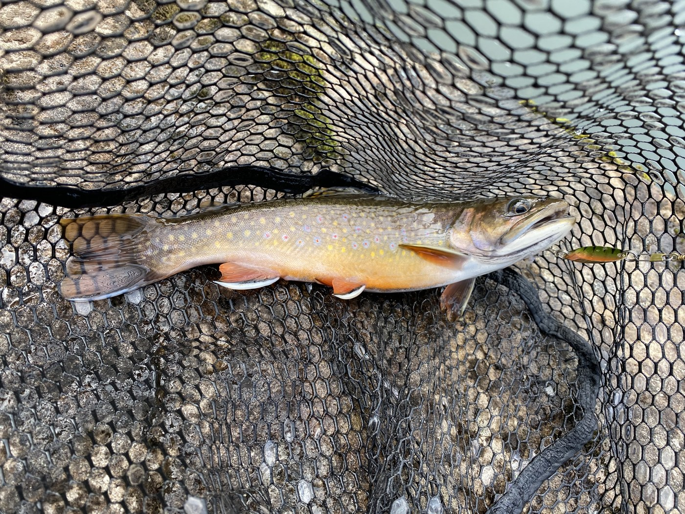 <em>Saturday, Oct. 17, 2020 -- A brook trout is resting on a fishing net, with a fishing lure visible near its mouth. [vision review (ollama/qwen2.5vl:7b)]</em> -- <a href="https://www.wta.org/go-hiking/trip-reports/trip_report-2020-10-19-3547626369">https://www.wta.org/go-hiking/trip-reports/trip_report-2020-10-19-3547626369</a>

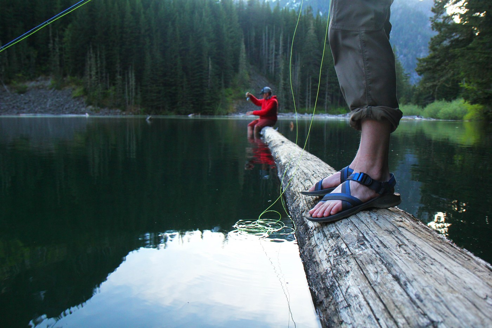 <em>Saturday, May. 7, 2016 -- A person is fly fishing from a log bridge over a calm lake surrounded by a forest. [vision review (ollama/qwen2.5vl:7b)]</em> -- <a href="https://www.wta.org/go-hiking/trip-reports/trip_report.2016-05-09.0128576607">https://www.wta.org/go-hiking/trip-reports/trip_report.2016-05-09.0128576607</a>

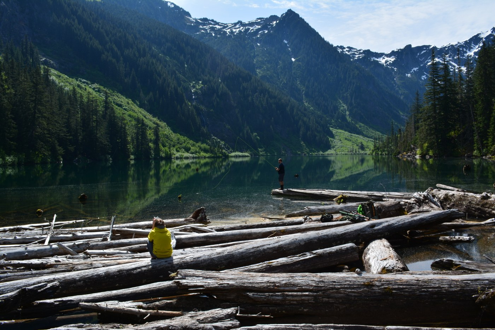 <em>Sunday, May. 31, 2015 -- A serene lakeside scene with a person sitting on logs and another standing in the water, both engaged in fishing activities. [vision review (ollama/qwen2.5vl:7b)]</em> -- <a href="https://www.wta.org/go-hiking/trip-reports/trip_report.2015-05-31.6860589216">https://www.wta.org/go-hiking/trip-reports/trip_report.2015-05-31.6860589216</a>

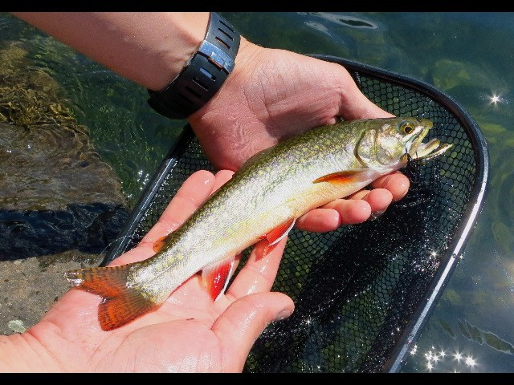 <em>Monday, Jun. 11, 2012 -- A person is holding a fish in their hands with a net in the background. [vision review (ollama/qwen2.5vl:7b)]</em> -- <a href="https://www.wta.org/go-hiking/trip-reports/trip_report.2012-06-12.3125362870">https://www.wta.org/go-hiking/trip-reports/trip_report.2012-06-12.3125362870</a>

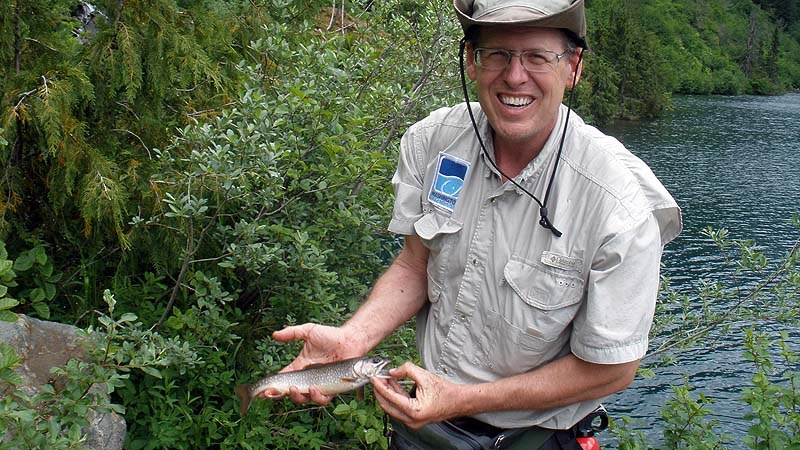 <em>Sunday, Jul. 11, 2010 -- A man is holding a small fish in his hands while standing near a body of water surrounded by greenery. [vision review (ollama/qwen2.5vl:7b)]</em> -- <a href="https://www.wta.org/go-hiking/trip-reports/trip_report.2010-07-12.8361070826">https://www.wta.org/go-hiking/trip-reports/trip_report.2010-07-12.8361070826</a>

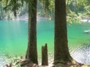 <em>Saturday, Jul. 4, 2009 -- A serene lake surrounded by tall trees with a person fishing in the water. [vision review (ollama/qwen2.5vl:7b)]</em> -- <a href="https://www.wta.org/go-hiking/trip-reports/trip_report.2009-07-06.0718985443">https://www.wta.org/go-hiking/trip-reports/trip_report.2009-07-06.0718985443</a>

 <em>Saturday, Jul. 4, 2009 -- A serene lake surrounded by tall trees with a person fishing in the water. [vision review (ollama/qwen2.5vl:7b)]</em> -- <a href="https://www.wta.org/go-hiking/trip-reports/trip_report.2009-07-06.0718985443">https://www.wta.org/go-hiking/trip-reports/trip_report.2009-07-06.0718985443</a>

**Text mentions:**

- **Saturday, Sep. 21, 2024** -- https://www.wta.org/go-hiking/trip-reports/trip_report-2024-09-26.155257504938
    - text ("fish"): "...end of a very easy hike/moderately challenging trail run. Lots of spots to set up a tent, fish, relax, and swim. The falls were also really fun to explore around. As a note for futur..."
- **Sunday, Aug. 25, 2024** -- https://www.wta.org/go-hiking/trip-reports/trip_report-2024-08-26.160329617022
    - text ("fish"): "...kers each (one group had 7). It must have been busy at the lake that afternoon. There are fish in the lake; I saw one jump. Someone left fishing tackle on the beach. Having hiked thi..."
    - text ("fishing"): "...busy at the lake that afternoon. There are fish in the lake; I saw one jump. Someone left fishing tackle on the beach. Having hiked this trail before, I didn’t remember all the logs tha..."
- **Wednesday, Jun. 26, 2024** -- https://www.wta.org/go-hiking/trip-reports/trip_report-2024-06-27.002348411083
    - text ("fish"): "...nset, but the lake to waterfalls to snow to sky transition easily made up for it. Lots of fish jumping at bugs, but the bugs were never too bad, some mosquitoes, a lot of small ones, n..."
    - text ("fish"): "...too bad, some mosquitoes, a lot of small ones, no flies. I saw an osprey swoop down at a fish but it missed. Hilarious seeing it do its little shimmy while flying away after to shake..."
    - text ("fish"): "...ter. About 5 minutes later it came back for another pass of the lake but didn't dive. The fish must have wizened up after the previous time and dove deep. Later I saw LOTS of bats, hol..."
- **Saturday, Jun. 22, 2024** -- https://www.wta.org/go-hiking/trip-reports/trip_report-2024-06-23.073647481731
    - text ("pack-raft"): "...Bottom Line: Hike to the lake, and pack-raft to the far (trail inaccessible) end, where we intended to scramble up into the basin to s..."
    - text ("pack-raft"): "...... the weather could have been sunnier ;) Stats: Distance: 13-3/4 miles (including pack-raft on lake) Duration: 6-1/4 hours Vertical: 1720 ft Road/Parking: Despite a "road clos..."
    - text ("pack-raft"): "..., and the rocks near McKintosh were very slippery. Takeaway: Reminder to self - always pack-raft with your hiking boots in case you change your mind and want to scramble even though it i..."
- **Wednesday, Jun. 12, 2024** -- https://www.wta.org/go-hiking/trip-reports/trip_report-2024-06-12.185506702335
    - text ("fishing"): "...long, just before my Turn-around-Point, i saw a young couple, Backpackers too - they were fishing. On my way BACK, i encountered a total of 4x BackPackers, and ~10x Dayhikers streaming..."
- **Friday, Jun. 7, 2024** -- https://www.wta.org/go-hiking/trip-reports/trip_report-2024-06-09.134312946002
    - text ("fishing"): "...the evening alpenglow was spectacular. We saw lots of birds, gold finches, and an osprey fishing. Caveat: unless you don't mind crowds and lots of off-leash dogs bounding around, skip th..."
- **Friday, Nov. 3, 2023** -- https://www.wta.org/go-hiking/trip-reports/trip_report.2023-11-04.0508771579
    - text ("trout"): "...s but the waterfalls were everywhere and the lake was very full. Caught a couple of brook trout too! Would definitely reccomend for a fall hike as we were the only ones at the lake!..."
- **Wednesday, Sep. 20, 2023** -- https://www.wta.org/go-hiking/trip-reports/trip_report.2023-09-21.4970011266
    - text ("fish"): "...ible beach. The snow melt is a lot smaller. We also saw two birds fighting over a small fish. See photo. There were also more mushrooms since it had rained the night before. It was..."
- **Friday, Oct. 14, 2022** -- https://www.wta.org/go-hiking/trip-reports/trip_report.2022-10-14.2860403093
    - text ("fish"): "...air quality. The Pacific Northwest is in desperate need of rain. I did see some small fish eating surface bugs while I hydrated and ate a little bit of food while sight seeing at G..."
- **Wednesday, Oct. 12, 2022** -- https://www.wta.org/go-hiking/trip-reports/trip_report.2022-10-15.8398648765
    - text ("fish"): "...light filtering through amid the colossal cedars. The lake itself was calm and little fish were jumping, dragonflies zooming around. The brush up the slopes are displaying some ni..."
- **Wednesday, Jul. 27, 2022** -- https://www.wta.org/go-hiking/trip-reports/trip_report.2022-07-27.2899314688
    - text ("fish"): "...Didn't hike it today just curious if anyone knows if this lake is legal to fish?..."
- **Saturday, Oct. 17, 2020** -- https://www.wta.org/go-hiking/trip-reports/trip_report-2020-10-19-3547626369
    - text ("Trout"): "...d the joy of rain in the morning and on the hike out. Mushrooms abounded, invasive Brook Trout were catchable (and delicious), and the large camping area with two new (2019 or 2020 vin..."
    - text ("fisherman"): "...fields for scrambling, there's a stable logjam that the adventurous can cross, there's a fisherman's trail that leads to fishing holes and a waterfall, and the well-used hillside campgroun..."
    - text ("fishing"): "...a stable logjam that the adventurous can cross, there's a fisherman's trail that leads to fishing holes and a waterfall, and the well-used hillside campground is open, which has its pluss..."
- **Monday, Sep. 21, 2020** -- https://www.wta.org/go-hiking/trip-reports/trip_report-2020-10-08-4074326497
    - text ("fish"): "...switchback toward the top to the lake but overall pretty easy hike. Lake was jumping with fish (trout?). Saw 4 people at the lake, plus one hunter. Passed a couple more people on the t..."
- **Friday, Aug. 14, 2020** -- https://www.wta.org/go-hiking/trip-reports/trip_report-2020-08-15-6886807429
    - text ("fishing"): "...consider that your reward for making it up there. More of a fisher than a floater? The fishing is hit and miss. Mostly miss. The most action came on little orange spoon - a few nibbles..."
- **Saturday, Jul. 25, 2020** -- https://www.wta.org/go-hiking/trip-reports/trip_report-2020-07-26-6821549952
    - text ("packraft"): "...te as the last mile to the lake is steep, bouldered and rooted. I brought along a klymet packraft https://www.amazon.com/KLYMIT-LITEWATER-Packraft-Inflatable-Backpacking/dp/B089392X13 whi..."
    - text ("Packraft"): "...ed and rooted. I brought along a klymet packraft https://www.amazon.com/KLYMIT-LITEWATER-Packraft-Inflatable-Backpacking/dp/B089392X13 which was awesome and payed for itself on this bike..."
- **Tuesday, Jul. 14, 2020** -- https://www.wta.org/go-hiking/trip-reports/trip_report-2020-07-14-8505840638
    - text ("pack rafts"): "...lake was quiet and calm when we arrived, and we paddled to the opposite end of it in our pack rafts. Saw roughly 20-25 people on the trail throughout the day. Perfect day!..."
- **Saturday, Jul. 11, 2020** -- https://www.wta.org/go-hiking/trip-reports/trip_report-2020-07-12-6245505272
    - text ("packrafts"): "...rts. There are lots of spots along the lake to spread out. We saw a group of hikers using packrafts which is such a good idea! Lake was beautiful and we lucked out with a sunny day. About 7..."
- **Wednesday, Aug. 14, 2019** -- https://www.wta.org/go-hiking/trip-reports/trip_report.2019-08-15.4946063944
    - text ("trout"): "...t we found a flat spot. The lake is very pretty and a short walk from campsites. There is trout available to catch for the patient even though I didn't catch anything. The trail is a lo..."
- **Saturday, Jun. 29, 2019** -- https://www.wta.org/go-hiking/trip-reports/trip_report.2019-07-01.8188489107
    - text ("fish"): "...m at bay almost entirely. Only other wildlife were some bold chipmunks and the occasional fish; didn't see a single goat! Plenty of hikers and a lot more campers showed up throughout..."
- **Saturday, Jun. 15, 2019** -- https://www.wta.org/go-hiking/trip-reports/trip_report.2019-06-18.8638462320
    - text ("salmon"): "...k back is a little more rugged, still beautiful. Lots of flowers blooming and a couple of salmon(?) berries. The campground got a little crowded throughout the Saturday afternoon, it w..."
- **Saturday, Jun. 8, 2019** -- https://www.wta.org/go-hiking/trip-reports/trip_report.2019-06-10.5034533820
    - text ("fish"): "...y. Both Saturday and Sunday there was a constant flow of day-hikers coming to the lake to fish or just sit by the lake and turn back around on the trail. On the way back we decided t..."
- **Thursday, May. 23, 2019** -- https://www.wta.org/go-hiking/trip-reports/trip_report.2019-05-24.7272639154
    - text ("Fish"): "...umps are reminders of old time logging operations. The lake is listed on the WA Dept of Fish & Wildlife as overpopulated with trout, so bring your pole. The fish aren’t active just y..."
    - text ("trout"): "...operations. The lake is listed on the WA Dept of Fish & Wildlife as overpopulated with trout, so bring your pole. The fish aren’t active just yet, but they will be soon. On the way..."
    - text ("fish"): "...ed on the WA Dept of Fish & Wildlife as overpopulated with trout, so bring your pole. The fish aren’t active just yet, but they will be soon. On the way down, I shared the trail with..."
- **Monday, Aug. 14, 2017** -- https://www.wta.org/go-hiking/trip-reports/trip_report.2017-08-14.2798463443
    - text ("trout"): "...ve walking most of the way down the lake trail. Got a few bites and caught one bite-sized trout in an hour or so fishing. We dealt with two showers the entire trip, neither needed rain..."
    - text ("fishing"): "...way down the lake trail. Got a few bites and caught one bite-sized trout in an hour or so fishing. We dealt with two showers the entire trip, neither needed rain gear. Pretty sure the upp..."
- **Sunday, Jul. 30, 2017** -- https://www.wta.org/go-hiking/trip-reports/trip_report.2017-07-30.3298132409
    - text ("pack raft"): "...ound 9am on Saturday am and snagged a beautiful spot with lake access, room to launch our pack raft and hang the hammock. Lots of campers cramming into not ideal campsites later in the day...."
    - text ("packraft"): "...lots of folks tried - but dead ends. Only way to see the other side of the lake is via a packraft. Totally different experience. My friend saw a momma bear and two cubs. Critters are used..."
- **Friday, Jun. 30, 2017** -- https://www.wta.org/go-hiking/trip-reports/trip_report.2017-07-02.9774617803
    - text ("fly fishing"): "...scrambling to do across the lake from the dam too and a small trail leading to a popular fly fishing spot. There is a trail that continues on beyond the spot where many stop for lunch. It..."
- **Tuesday, Sep. 13, 2016** -- https://www.wta.org/go-hiking/trip-reports/trip_report.2016-09-24.3961254000
    - text ("Fish"): "...to high summer and water level going down. Could easily wade or walk to less mucky areas. Fish were JUMPING!..."
- **Saturday, Aug. 13, 2016** -- https://www.wta.org/go-hiking/trip-reports/trip_report.2016-08-15.4881042497
    - text ("fish"): ".... Only negative was a stick in the eye, falling off the trail and - we couldn't hook the fish as they taunted us - jumping in the middle of the lake...."
- **Friday, Jul. 29, 2016** -- https://www.wta.org/go-hiking/trip-reports/trip_report.2016-08-02.9526620655
    - text ("Trout"): "...o nights and fished the lake with some success and a LOT of fun. Caught a couple of Brook Trout and they made for a delicious dinner one of the nights. I made the hike back to the car S..."
- **Saturday, May. 7, 2016** -- https://www.wta.org/go-hiking/trip-reports/trip_report.2016-05-09.0128576607
    - text ("fish"): "...oughout the evening, though nothing too big. The mosquitoes may have been bigger than the fish... only a few of them out there right now, though! It was a lovely night out there - qui..."
- **Sunday, Sep. 20, 2015** -- https://www.wta.org/go-hiking/trip-reports/trip_report.2015-09-21.1365520060
    - text ("Fish"): "...under a tree with a great view and - since why the heck not - a perfect spot to wade in. Fish were jumping, fog was taking over the mountains around, it was just beautiful! Goat Lake..."
- **Sunday, Jun. 14, 2015** -- https://www.wta.org/go-hiking/trip-reports/trip_report.2015-06-15.8447775164
    - text ("fish"): "...stuck in soft mud on the side of the road as I veered to avoid a pothole. Someone had to fish me out and I drove home disappointed and beaten by the stressful events of the day. I dec..."
- **Sunday, May. 31, 2015** -- https://www.wta.org/go-hiking/trip-reports/trip_report.2015-05-31.6860589216
    - text ("fish"): "...s a GORGEOUS LAKE! It didn't seem real. We sat by the logs for a while watching someone fish and watching his dog splash in the water, and then found some shade and ate our lunch. T..."
- **Saturday, Sep. 6, 2014** -- https://www.wta.org/go-hiking/trip-reports/trip_report.2014-09-08.9543630513
    - text ("trout"): "...erfly that kept fluttering around my head at one point. Other tips: lake has some rainbow trout, and no campfires allowed. We also much preferred the "lower elliott" trail as opposed to..."
- **Sunday, Aug. 17, 2014** -- https://www.wta.org/go-hiking/trip-reports/trip_report.2014-08-17.2032676589
    - text ("trout"): "...ay. All campsites were full so I had to hike up a goat hill and make my own. Caught a 6'' trout in the lake. Bugs were bad by the car and for the first two miles, after that they go awa..."
- **Friday, May. 23, 2014** -- https://www.wta.org/go-hiking/trip-reports/trip_report.2014-05-25.5565183163
    - text ("fishing"): "...privacy. After a rainy night, we woke, made breakfast and packed our things grabbed the fishing poles and headed for the lake. The trail down the North side of the lake is very good tra..."
    - text ("fish"): "...waterfall and beautiful views of Ida Pass and surrounding mountains. We did not catch any fish, but I hear they are there. After spending a couple of hours exploring the lake we start..."
- **Saturday, Oct. 5, 2013** -- https://www.wta.org/go-hiking/trip-reports/trip_report.2013-10-06.3256317905
    - text ("fisherman"): "...rived at Goat Lake, there were about 10 people there enjpying the views and the lake, one fisherman and two inflatable rafts in the lake. We stayed up there for an hour before the sun went..."
- **Friday, May. 10, 2013** -- https://www.wta.org/go-hiking/trip-reports/trip_report.2013-05-10.7677505629
    - text ("fishing"): "...at the lake, but it sure was nice to see such an enthusiastic group of young people with fishing poles and sleeping bags strapped to their packs! I've been seeing more of this lately......."
- **Saturday, Aug. 18, 2012** -- https://www.wta.org/go-hiking/trip-reports/trip_report.2012-08-20.5280932464
    - text ("trout"): "...ake trail bushwacking, taking dips in the chilly lake, taking underwater pictures of baby trout, and enjoying our late lunch, we spent a good 2 hours relaxing at the lake. On the way ba..."
- **Wednesday, Jul. 4, 2012** -- https://www.wta.org/go-hiking/trip-reports/trip_report.2012-07-05.8891209084
- **Saturday, Jun. 23, 2012** -- https://www.wta.org/go-hiking/trip-reports/trip_report.2012-06-24.9283930882
    - text ("fish"): "...to come out. Lots of water on the trail. Everything is fresh and green. Didn’t catch any fish. Someone approached one of our group wanting to team up on some hikes. Just call the Chu..."
- **Monday, Jun. 11, 2012** -- https://www.wta.org/go-hiking/trip-reports/trip_report.2012-06-12.3125362870
    - text ("fishing"): "...d totally snow free. Several camping spots and lots of access to the lake for wading and fishing. On the fishing side, we fishing for a couple of hours and caught 4 trout 8-12 inches in..."
    - text ("fishing"): "...ing spots and lots of access to the lake for wading and fishing. On the fishing side, we fishing for a couple of hours and caught 4 trout 8-12 inches in length using spinning set-up. Th..."
    - text ("trout"): "...r wading and fishing. On the fishing side, we fishing for a couple of hours and caught 4 trout 8-12 inches in length using spinning set-up. There is not a lot of bugs yet, so fly fish..."
- **Sunday, May. 27, 2012** -- https://www.wta.org/go-hiking/trip-reports/trip_report.2012-05-30.3980721339
    - text ("fishing"): "...ne. Snow entirely melted off lake. A handful of people camped over the night before were fishing, roaming with pets. Around the lake, there definitely is a TON of blow downs, which seem..."
- **Friday, Jul. 22, 2011** -- https://www.wta.org/go-hiking/trip-reports/trip_report.2011-07-25.6599009316
    - text ("fishing"): "...w many people come and go thru the day. However, it never felt crowded. Enjoyed some good fishing and beautiful scenery. Hiked out Sunday...."
- **Sunday, Jun. 26, 2011** -- https://www.wta.org/go-hiking/trip-reports/trip_report.2011-06-30.0148324321
    - text ("fishing"): "...great, the upper one has its nice parts but is longer and overall a bit tedious. We tried fishing at the lake but no luck...."
- **Wednesday, Aug. 11, 2010** -- https://www.wta.org/go-hiking/trip-reports/trip_report.2010-08-12.3821751077
    - text ("trout"): "...found a good sitting spot for a snack, enjoyed the views up the lake, and noted many tiny trout foraging in the shallows. While we enjoyed the lake and surrounding peaks, the highlight..."
- **Sunday, Jul. 11, 2010** -- https://www.wta.org/go-hiking/trip-reports/trip_report.2010-07-12.8361070826
    - text ("fishing"): "...mpgrounds. We also went to the far end of the lake where the upper falls are and did some fishing (and catching) of eastern brook trout (all caught and released). The brush trail to this..."
    - text ("trout"): "...f the lake where the upper falls are and did some fishing (and catching) of eastern brook trout (all caught and released). The brush trail to this falls is pretty rough and slow going...."
- **Saturday, Jul. 4, 2009** -- https://www.wta.org/go-hiking/trip-reports/trip_report.2009-07-06.0718985443
    - text ("fishing"): "...bsolutely beautiful - blue & green - stopped for awhile and had lunch. Quite a few people fishing and camping at the lake. Be sure to check out the waterfall coming out of the lake on you..."
- **Friday, Jul. 14, 2000** -- https://www.wta.org/go-hiking/trip-reports/tripreport-2000071520
    - text ("fish"): "...tained trail and snow free condition are likely to blame along with an abundant supply of fish I assume since most of the people there had a fishing rod. We barely managed to find a se..."
    - text ("fishing"): "...blame along with an abundant supply of fish I assume since most of the people there had a fishing rod. We barely managed to find a semi-level spot in amongst two dozen or more tents. The..."

### Copper Ridge Loop

https://www.wta.org/go-hiking/hikes/copper-ridge-loop

_86 photo(s) downloaded for visual review, 5 contact sheet(s) generated._

**Fishing photos (3):**

 <em>Friday, Aug. 25, 2017 -- Sockeye salmon [caption match]</em> -- <a href="https://www.wta.org/go-hiking/trip-reports/trip_report.2017-08-30.9583689332">https://www.wta.org/go-hiking/trip-reports/trip_report.2017-08-30.9583689332</a>

 <em>Thursday, Aug. 3, 2017 -- Spawning Sockeye salmon all the way from Bellingham! [caption match]</em> -- <a href="https://www.wta.org/go-hiking/trip-reports/trip_report.2017-08-07.6146606697">https://www.wta.org/go-hiking/trip-reports/trip_report.2017-08-07.6146606697</a>

 <em>Tuesday, Aug. 23, 2016 -- Spawning Salmon at Indian Creek [caption match]</em> -- <a href="https://www.wta.org/go-hiking/trip-reports/trip_report.2016-08-23.9957117509">https://www.wta.org/go-hiking/trip-reports/trip_report.2016-08-23.9957117509</a>

**Text mentions:**

- **Sunday, Aug. 21, 2022** -- https://www.wta.org/go-hiking/trip-reports/trip_report.2022-09-02.2189870414
    - text ("salmon"): "...ey finished up that afternoon. We continued down uneventfully, took a moment to watch the salmon while we crossed the river, and then moved onto the final 5-6miles of absolutely joyous f..."
- **Saturday, Aug. 20, 2022** -- https://www.wta.org/go-hiking/trip-reports/trip_report.2022-08-26.1530054011
    - text ("salmon"): "...red, and we actually ran into the team that was clearing them (thanks guys!!). There were salmon spawning in the Chilliwack River, where you have to ford to cross it. The river level was..."
- **Thursday, Aug. 18, 2022** -- https://www.wta.org/go-hiking/trip-reports/trip_report.2022-08-24.0922809971
    - text ("salmon"): "...thing major before crossing the Chilliwack, and flagging was easy to spot. We watched the salmon work as hard as they could get swim upstream for a bit, then switched into Tevas to get a..."
- **Friday, Aug. 12, 2022** -- https://www.wta.org/go-hiking/trip-reports/trip_report.2022-08-17.7396377143
    - text ("kokanee"): "...mostly uphill Coolest part of this whole trip was seeing the huge bright red sockeye/kokanee salmon spawning in the Chilliwack river right where you ford across. I've never seen anyt..."
    - text ("salmon"): "...Took some underwater videos with my camera. Ranger back at the wilderness center said the salmon will start to die soon (we did see some with graying backs and fin) and bears, birds, mar..."
    - text ("salmon"): "...forest soil. Sometimes birds will carry the carcasses up the ridge to eat, and you'll see salmon heads in the trees as you hike! The Chilliwack River ford was about knee-deep, very cold,..."
- **Friday, Aug. 12, 2022** -- https://www.wta.org/go-hiking/trip-reports/trip_report.2022-08-13.8716472866
    - text ("Salmon"): "...nd wearing pants -- my running shorts were soaked and lots of scratches on lower legs). Salmon are spawning at the river ford before Indian Creek Camp, which helped to lift my spirits..."
    - text ("salmon"): "...excite me. To me, the only redeeming features of this half of the loop were the spawning salmon and cable car. But, to be fair, it could have been the 20+ miles I already had in my leg..."
- **Saturday, Aug. 6, 2022** -- https://www.wta.org/go-hiking/trip-reports/trip_report.2022-12-02.9019898624
    - text ("salmon"): "...ater. I think at the deepest part, the water never went over my knees. Lots of spawning salmon! The climb up from the river to Copper Lake was a bit rough with some trail obscured area..."
- **Saturday, Jul. 24, 2021** -- https://www.wta.org/go-hiking/trip-reports/trip_report-2021-07-25-5304324028
    - text ("fish"): "...were going to camp at Egg lake and had finishing rods with them. Didn't know egg lake had fish. Views from Silesia campground are great and keeps on getting better. The last section..."
- **Sunday, Sep. 6, 2020** -- https://www.wta.org/go-hiking/trip-reports/trip_report-2020-09-06-9653941367
    - text ("Salmon"): "...rossing was very easy in the morning mid-calf, I am 5'10" (I used poles, but not needed). Salmon still spawning as of 8/3. One of the two braids of the river is dry so you just have the..."
- **Saturday, Sep. 5, 2020** -- https://www.wta.org/go-hiking/trip-reports/trip_report-2020-09-09-0892045896
    - text ("salmon"): "...out at my knees. I forded without shoes without any trouble. You may be lucky to see some salmon swimming upstream - keep an eye out! Indian Creek Camp is quiet and under a large canopy..."
- **Thursday, Aug. 27, 2020** -- https://www.wta.org/go-hiking/trip-reports/trip_report-2020-09-03-2076785597
    - text ("salmon"): "...y to Indian Creek camp for a break. Once we got to Indian Creek, we realized the spawning salmon weren’t that far up, so we ran back down the the ford and watched them for 30-45 mins. Af..."
- **Wednesday, Aug. 26, 2020** -- https://www.wta.org/go-hiking/trip-reports/trip_report-2020-08-26-3613934778
    - text ("Salmon"): "...k, we did have to Ford. River came just above my knees and wasn’t too difficult to cross. Salmon were spawning which was a nice surprise. Copper Ridge is INSANELY beautiful. If we could,..."
- **Saturday, Aug. 22, 2020** -- https://www.wta.org/go-hiking/trip-reports/trip_report-2020-08-25-8245079757
    - text ("Salmon"): "...pots were thick and wet with morning dew. River ford was about mid-calf at 1pm on Sunday. Salmon are spawning and fun to watch. Berries are ripening around the whole loop but are just s..."
- **Thursday, Aug. 13, 2020** -- https://www.wta.org/go-hiking/trip-reports/trip_report-2020-08-17-1692989614
    - text ("salmon"): "...overgrown but manageable. Once you get to the river be sure to look out for the spawning salmon, definitely an impressive sight (double impressive when you calculate how far upstream th..."
- **Saturday, Aug. 1, 2020** -- https://www.wta.org/go-hiking/trip-reports/trip_report-2020-08-07-0622735294
    - text ("salmon"): "...cked off my feet. I was more worried about how cold my feet were half way across. I saw 7 salmon trying to swim (not very successfully) upstream. Indian Creek camp: 3 camp sites (but 4 g..."
    - text ("salmon"): "...cable car above the river and enjoyed the view and look (unsuccessfully) looked for more salmon. I didn't use gloves and my hands felt fine. It's a bit of a arm workout pulling one's se..."
- **Saturday, Aug. 31, 2019** -- https://www.wta.org/go-hiking/trip-reports/trip_report.2019-09-02.2731586412
    - text ("salmon"): "...re lots of berries along the trail. I saw one black bear north of Copper Lake and a dozen salmon in the Chilliwack River...."
- **Saturday, Aug. 4, 2018** -- https://www.wta.org/go-hiking/trip-reports/trip_report.2018-08-09.5817228831
    - text ("salmon"): "...us to the best spot to ford. The water was just below our knees at noon (and no spawning salmon yet). We had a hard time finding the trail on the other side of the creek and it look the..."
- **Monday, Sep. 18, 2017** -- https://www.wta.org/go-hiking/trip-reports/trip_report.2017-09-30.5703522447
    - text ("Salmon"): "...r than be in the valley on the clear day and the ridge on the wet days. So we missed the Salmon and cable car. Camped at trailhead, next morning we humped it to Hannegan Pass and ran i..."
- **Friday, Aug. 25, 2017** -- https://www.wta.org/go-hiking/trip-reports/trip_report.2017-08-30.9583689332
    - text ("salmon"): "...incredible. We saw one bear by Silesia camp, and another bear past Copper Lake. Sockeye salmon were running and they were really fun to watch in the river. The ranger told us that the..."
- **Monday, Aug. 14, 2017** -- https://www.wta.org/go-hiking/trip-reports/trip_report.2017-08-18.8522526106
    - text ("salmon"): "...ankfully, I was able to replenish before we crossed the river. There we saw the spawning salmon and the remains of a few bear eaten salmon carcasses. The trail from this point has a lo..."
    - text ("salmon"): "...crossed the river. There we saw the spawning salmon and the remains of a few bear eaten salmon carcasses. The trail from this point has a lot of vegetation growing over the trail. We..."
- **Thursday, Aug. 3, 2017** -- https://www.wta.org/go-hiking/trip-reports/trip_report.2017-08-07.6146606697
    - text ("salmon"): "...ee the trail. Keep your eyes on the river as you're walking by, we saw spawning Sockeye salmon! Indian Creek Camp was fly free! Yay! Enjoyed a dip in the river and a night in a maje..."
- **Tuesday, Aug. 1, 2017** -- https://www.wta.org/go-hiking/trip-reports/trip_report.2017-08-05.5842440157
    - text ("salmon"): "...t no current, though about mid-thigh deep and pretty cold. Easy to cross. Also look for salmon in the river! Trail to Indian Creek camp is quite overgrown but largely free of blowdown...."
- **Tuesday, Sep. 13, 2016** -- https://www.wta.org/go-hiking/trip-reports/trip_report.2016-09-13.4086369521
    - text ("salmon"): "...ne lakes, jagged peaks, abundant wildlife, rainforest floors, old growth forest, spawning salmon, cable car river crossing, 360 degree views and the solitude, this hike is an absolute mu..."
- **Friday, Sep. 9, 2016** -- https://www.wta.org/go-hiking/trip-reports/trip_report.2016-09-12.5021576949
    - text ("salmon"): "...In short, the bears are gorging, the salmon are dying, and the berries are divine. We arrived at the Glacier ranger station a half h..."
    - text ("salmon"): "...hey've been busy. I knew it was the end of spawning season, but I had hoped to see some salmon still. At first we saw only decaying bodies, but after searching a bit we were rewarded w..."
    - text ("salmon"): "...saw only decaying bodies, but after searching a bit we were rewarded with a few remaining salmon looking for love. It always blows my mind to think about how they fight so hard to return..."
- **Tuesday, Aug. 23, 2016** -- https://www.wta.org/go-hiking/trip-reports/trip_report.2016-08-23.9957117509
    - text ("salmon"): "...ns were helpful. One of the highlights of this day was the 50 plus beautiful red spawning salmon near the log crossing. It was quite an amazing site. We talked to a fellow hiker the nex..."
    - text ("salmon"): "...and original facets with spectacular views. My favorites were the fire lookout, spawning salmon, hand pulled cable car...."
- **Saturday, Aug. 6, 2016** -- https://www.wta.org/go-hiking/trip-reports/trip_report.2016-08-07.1521763001
    - text ("salmon"): "...too many down trees until near the bottom. On the second creek crossing, we saw over 50 salmon in the river, hanging out and waiting to spawn. That was probably the highlight for me, o..."
- **Thursday, Jul. 28, 2016** -- https://www.wta.org/go-hiking/trip-reports/trip_report.2016-08-01.3604276114
    - text ("salmon"): "...the other side, but follow the markers to a wide log bridge. We counted dozens of sockeye salmon hanging out in the clear water below. So pink, so … weird. A fallen tree took out the sig..."

### Twin Lakes - Monte Cristo

https://www.wta.org/go-hiking/hikes/twin-lakes-monte-cristo

_56 photo(s) downloaded for visual review, 3 contact sheet(s) generated._

**Fishing photos (2):**

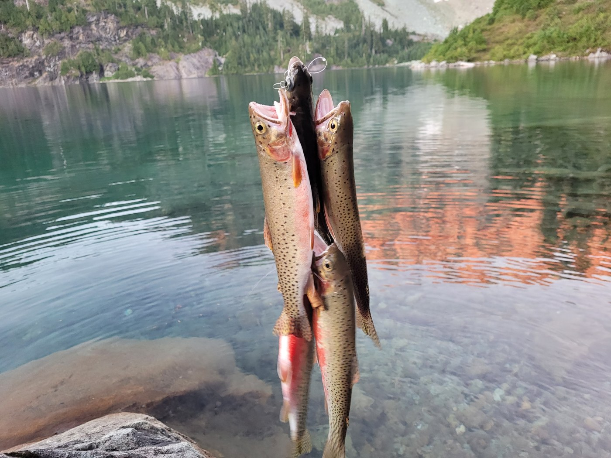 <em>Tuesday, Sep. 6, 2022 -- A fishing line holds four rainbow trout above a serene lake with rocky cliffs and trees in the background. [vision review (ollama/qwen2.5vl:7b)]</em> -- <a href="https://www.wta.org/go-hiking/trip-reports/trip_report.2022-09-08.2325490914">https://www.wta.org/go-hiking/trip-reports/trip_report.2022-09-08.2325490914</a>

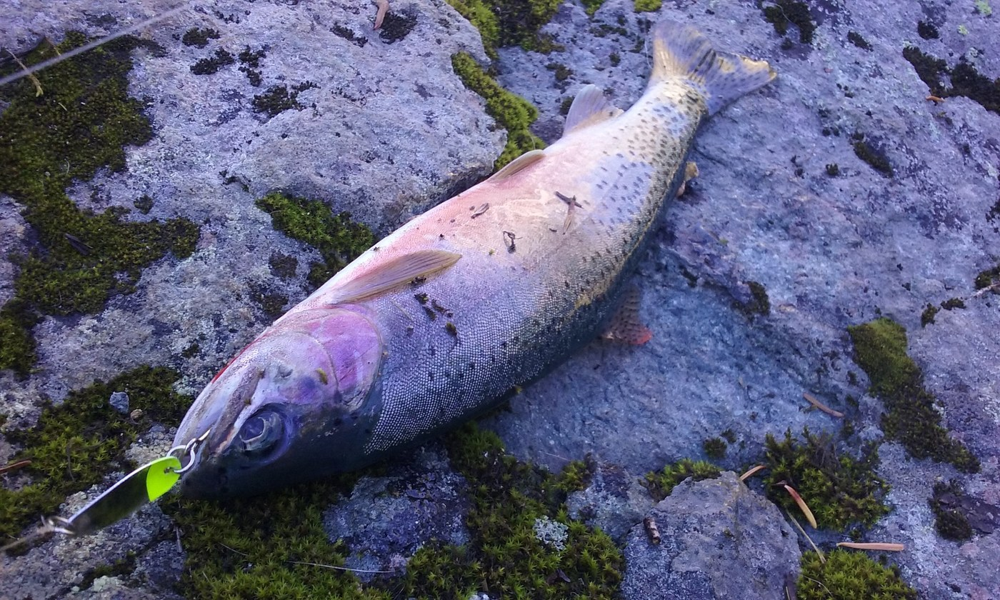 <em>Monday, Sep. 20, 2021 -- A freshly caught fish lies on a mossy rock, with a fishing lure still attached to its mouth. [vision review (ollama/qwen2.5vl:7b)]</em> -- <a href="https://www.wta.org/go-hiking/trip-reports/trip_report-2021-09-26-2232515585">https://www.wta.org/go-hiking/trip-reports/trip_report-2021-09-26-2232515585</a>

**Text mentions:**

- **Thursday, Jul. 24, 2025** -- https://www.wta.org/go-hiking/trip-reports/trip_report-2025-07-28.134339120405
    - text ("fly fishing"): "...This was our second visit since our first trip in 2021. The weather was perfect, and the fly fishing (catch and release) was good with lots of brook trout in the 8 to 12 inch range. The bugs..."
    - text ("trout"): "...weather was perfect, and the fly fishing (catch and release) was good with lots of brook trout in the 8 to 12 inch range. The bugs were bothersome in the morning and evening, but they..."
- **Thursday, Jul. 17, 2025** -- https://www.wta.org/go-hiking/trip-reports/trip_report-2025-07-22.232323146964
    - text ("fishing"): "...ound the lake trying to find a trail that lead to the lower lake as it is an overabundant fishing lake and we wanted to catch some brook trout. We reached a lot of dead ends of forgotten..."
    - text ("trout"): "...to the lower lake as it is an overabundant fishing lake and we wanted to catch some brook trout. We reached a lot of dead ends of forgotten trails but after some back tracking we made i..."
    - text ("fish"): "...ed like they haven't seen visitors in years. We found a great spot to hang out and caught fish on almost every cast. It was amazing! The lower lake wasn't quite as stunning as the upp..."
- **Monday, Jul. 15, 2024** -- https://www.wta.org/go-hiking/trip-reports/trip_report-2024-07-17.234559658305
    - text ("fishing"): "...w fields to cross (we did fine with just hiking poles). Silver Lake is pretty. We brought fishing poles but did not spot any sign of fish activities at Silver Lake...."
    - text ("fish"): "...king poles). Silver Lake is pretty. We brought fishing poles but did not spot any sign of fish activities at Silver Lake...."
- **Saturday, Aug. 26, 2023** -- https://www.wta.org/go-hiking/trip-reports/trip_report.2023-08-28.3675267934
    - text ("fish"): "...cky beach. Couple of other groups but surprisingly not busy for a Saturday night. Lots of fish in the larger lake. Saw some fresh bear scat on the trail just after the Silver lake turn..."
- **Tuesday, Sep. 6, 2022** -- https://www.wta.org/go-hiking/trip-reports/trip_report.2022-09-08.2325490914
    - text ("fishing"): "...I went out to the Twin Lakes for an overnight fishing trip. The trailhead at Barlow Pass was emptying out when I arrived the morning after Lab..."
    - text ("fishing"): "...camps, but there is lots of camping on The north end, too. Once in camp I busted out my fishing pole and planted myself by the lake for the afternoon and evening. I caught my limit in..."
    - text ("fish"): "...fternoon and evening. I caught my limit in just a few hours and had them chilling on the fish stringer waiting for breakfast. I slept under the stars that night and woke up to find m..."
- **Sunday, Aug. 14, 2022** -- https://www.wta.org/go-hiking/trip-reports/trip_report.2022-12-05.5305252381
    - text ("Trout"): "...n, a gentleman from Silver Lake showed up and was kind enough to share his freshly caught Trout with me for dinner that night! Wow! I love the mountains where folk’s inner generosity..."
- **Saturday, Aug. 13, 2022** -- https://www.wta.org/go-hiking/trip-reports/trip_report.2022-08-15.6835116977
    - text ("fish"): "...f lake, I continued on side semi-bush whacking on south side of lake. Beautiful lake with fish jumping. Heading back, was VERY slow and at crest, I thought I might be off trail (I'm SU..."
- **Monday, Sep. 20, 2021** -- https://www.wta.org/go-hiking/trip-reports/trip_report-2021-09-26-2232515585
    - text ("fishing"): "...p to the east which you will probably notice on the way in. Chores done, I busted out my fishing pole and went to invite the local trout to dinner (muwahaha!). The established campsite..."
    - text ("trout"): "...ce on the way in. Chores done, I busted out my fishing pole and went to invite the local trout to dinner (muwahaha!). The established campsite by the lake outlet is a perfect spot to..."
    - text ("fish"): "...to dinner (muwahaha!). The established campsite by the lake outlet is a perfect spot to fish from the shore. I caught 6 rainbow trout while I was out there, 2 of which ended up in t..."
- **Friday, Aug. 20, 2021** -- https://www.wta.org/go-hiking/trip-reports/trip_report-2021-08-23-6183089583
    - text ("fish"): "...ds, we saw very little wildlife (and really no signs of any wildlife). We saw plenty of fish jumping/surfacing in the lake. Next time I'll bring my fly rod...."
    - text ("fly rod"): "...wildlife). We saw plenty of fish jumping/surfacing in the lake. Next time I'll bring my fly rod...."
- **Saturday, Aug. 29, 2020** -- https://www.wta.org/go-hiking/trip-reports/trip_report-2020-08-30-7309237089
    - text ("Fish"): "...'t have any issues with bugs...maybe because there was a consistent breeze all afternoon. Fish were jumping all afternoon, lots of medium sized trout, but surprisingly not around dusk..."
    - text ("trout"): "...a consistent breeze all afternoon. Fish were jumping all afternoon, lots of medium sized trout, but surprisingly not around dusk or dawn. Seems like there are a few campsites between t..."
- **Thursday, Aug. 13, 2020** -- https://www.wta.org/go-hiking/trip-reports/trip_report-2020-08-14-2652705488
    - text ("fish"): "...e fire pit area needs to be cleaned out better to discourage people from using it. The fish were jumping and the bugs were biting, but a little spray helped keep them at bay. I high..."
- **Sunday, Aug. 9, 2020** -- https://www.wta.org/go-hiking/trip-reports/trip_report-2020-08-11-2342253147
    - text ("anglers"): "...on the beach below the Columbia Peak boulder field. There was only one other party: three anglers camped at the lakes that brought along an inflatable boat. Sweet! The night was cool an..."
- **Thursday, Oct. 11, 2018** -- https://www.wta.org/go-hiking/trip-reports/trip_report.2018-10-14.6895246246
    - text ("fishing"): "...ay but woke up not feeling so great so I just explored around the lake and did a bunch of fishing. The fish aren't huge, but I was getting hits on almost every cast, as apposed to Silver..."
    - text ("fish"): "...ng hits on almost every cast, as apposed to Silver Lake which apparently doesn't have any fish. It's a shame there is a permanent fire ban (despite several fire pits around the lake),..."
    - text ("fish"): "...ame there is a permanent fire ban (despite several fire pits around the lake), as cooking fish over a pack stove is less than ideal. There was fresh bear scat on the trail 1/2 mile..."
- **Saturday, Sep. 1, 2018** -- https://www.wta.org/go-hiking/trip-reports/trip_report.2018-09-11.6148264401
    - text ("fishing"): "...of a large campfire, scorched rock, and a garbage dump. WTF? Tarps, sleeping pad, broken fishing rod, and several other items were piled in a heap. Grrr!!! As there were three other gr..."
- **Saturday, Aug. 19, 2017** -- https://www.wta.org/go-hiking/trip-reports/trip_report.2018-07-12.3907049781
    - text ("trout"): "...tiful, recent history, thigh-burning gain, and some more beauty. there's even some hungry trout in the lakes - I caught four myself. I'll start by saying my GPS said I put in a total o..."
- **Saturday, Aug. 5, 2017** -- https://www.wta.org/go-hiking/trip-reports/trip_report.2017-08-07.6790724089
    - text ("fish"): "...n sketchy exposed sections. Might not be needed for a day hike. Twin Lakes had TONS of fish, some 8-10 inches long by my estimate, and they were very active all day long. It was co..."
- **Tuesday, Aug. 1, 2017** -- https://www.wta.org/go-hiking/trip-reports/trip_report.2017-08-03.6869988038
    - text ("fish"): "...to the area between the two lakes where there were a few more nice camping sites. I don't fish, but I saw plenty in the higher lake...."
- **Thursday, Aug. 18, 2016** -- https://www.wta.org/go-hiking/trip-reports/trip_report.2017-04-21.5276005446
    - text ("trout"): "...Awesome time at Twin Lakes. Be sure to pack sunscreen in the summer though. Wild trout are in the first lake; taste great over a fire. Lots of fun to be had in the glacial boul..."
- **Friday, Sep. 28, 2012** -- https://www.wta.org/go-hiking/trip-reports/trip_report.2012-10-01.4884246814
    - text ("Fish"): "...Joining me on this trip was Beano, Neil B., Mr. Fish, and B. the wonder dog. I'd wanted to camp at Twin Lakes since visiting them on a day tri..."
    - text ("fishing"): "...it's down about 700 feet to the first lake. We quickly set up camp and then commenced to fishing for our dinner. We weren't disappointed. The next day we set off to explore the lower lak..."
    - text ("Fish"): "...ke. They seem to go on and on and become more scenic as you go. Next day, Neil B. and Mr. Fish had to leave, but Beano and I stayed another day. We decided to find a better route to th..."
- **Saturday, Sep. 15, 2012** -- https://www.wta.org/go-hiking/trip-reports/trip_report.2012-09-21.1555443880
    - text ("fishing"): "...net and butterflies adorning the thistle. A returning hiker reported excellent cutthroat fishing. (Sadly, not everyone had resisted the temptation to build campfires for cooking of same..."
- **Saturday, Aug. 25, 2012** -- https://www.wta.org/go-hiking/trip-reports/trip_report.2012-08-27.9118685268
    - text ("fish"): "...you find other places. Lakes are crystal clear and beautiful to sit and watch. Saw a few fish jumping and another group caught and released some cutthroat trout at Twin Lakes...."
    - text ("trout"): "...it and watch. Saw a few fish jumping and another group caught and released some cutthroat trout at Twin Lakes...."
- **Saturday, Aug. 12, 2006** -- https://www.wta.org/go-hiking/trip-reports/tripreport-2006081317
    - text ("fisherman"): "...ehind you, and the two Twin Lakes below, then begin the 700 foot drop to the lakes down a fisherman's trail. Lake is great for rafting and swimming (and fishing). Fires not allowed within 1..."
    - text ("fishing"): "...t drop to the lakes down a fisherman's trail. Lake is great for rafting and swimming (and fishing). Fires not allowed within 1/4 mile of lakes. Camp sites available at North end of large..."
- **Thursday, Jul. 28, 2005** -- https://www.wta.org/go-hiking/trip-reports/tripreport-2005072906
    - text ("fish"): "...bugs except for peskey black flies at Monte Cristo on way out....no bugs at lakes....but fish jumping. Water temp. at lakes is very good for swimming...."
- **Wednesday, Sep. 3, 2003** -- https://www.wta.org/go-hiking/trip-reports/tripreport-2003090402
    - text ("fish"): "...ail. There were 3 camping groups returning from Twin Lakes and one reported catching some fish. This part of the trail would be very difficult with a fully loaded backpack. The cruise..."
- **Tuesday, Jul. 15, 2003** -- https://www.wta.org/go-hiking/trip-reports/tripreport-2003071603
    - text ("fish"): "...or this trail. The bugs were only a problem at dusk after the wind died. All evening the fish splashes indicated they appreciated a plentiful bug supply. I wished I had a rod and reel..."

### Slide Lake

https://www.wta.org/go-hiking/hikes/slide-lake

_32 photo(s) downloaded for visual review, 2 contact sheet(s) generated._

**Fishing photos (2):**

 <em>Friday, May. 26, 2017 -- cute little trout [caption match]</em> -- <a href="https://www.wta.org/go-hiking/trip-reports/trip_report.2017-05-29.0115010615">https://www.wta.org/go-hiking/trip-reports/trip_report.2017-05-29.0115010615</a>

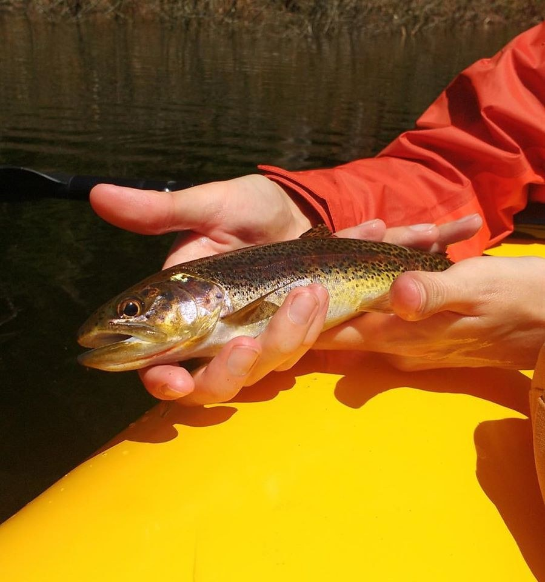 <em>Friday, May. 26, 2017 -- A person is holding a fish in their hands while sitting in a yellow kayak. [vision review (ollama/qwen2.5vl:7b)]</em> -- <a href="https://www.wta.org/go-hiking/trip-reports/trip_report.2017-05-29.0115010615">https://www.wta.org/go-hiking/trip-reports/trip_report.2017-05-29.0115010615</a>

**Text mentions:**

- **Friday, Jun. 27, 2025** -- https://www.wta.org/go-hiking/trip-reports/trip_report-2025-06-28.090238755536
    - text ("fish"): "...all these down trees. There are a few lowland wildflowers starting to bloom and lots of fish jumping in the lake. Road was very brushy, small slide that was easily passable unless y..."
- **Thursday, Aug. 8, 2024** -- https://www.wta.org/go-hiking/trip-reports/trip_report-2024-08-12.135206748046
    - text ("Fish"): "...s really pretty, with Snow King looming in the background, we enjoyed sunrise and sunset. Fish were jumping nearly constantly, which made since because bugs were awful. Nearly constant..."
    - text ("fish"): "...t off the to the left of the trail about halfway up the lake. Wildlife: Other than the fish and bugs we didn't really see anything outside of some Douglas Squirells..."
- **Saturday, Aug. 5, 2023** -- https://www.wta.org/go-hiking/trip-reports/trip_report.2023-08-07.4164842111
    - text ("fishing"): "...Lots of yummy thimbleberries. Huckleberries too, but not quite prime yet. A large group fishing and swimming at the lake when we arrived. Lake is low. Most folks cleared out by 5pm. Onl..."
    - text ("anglers"): "...pm. Only other group of campers in the first (and largest) campsite. Saw just four hikers/anglers on the hike out Sunday. The report slights the campsites at the top of the lake as sub-..."
- **Monday, Oct. 17, 2022** -- https://www.wta.org/go-hiking/trip-reports/trip_report.2022-11-01.3184390703
    - text ("fishing"): "...efinitely worth it. If you go earlier in the year the lake looks like it would be fun for fishing. During our visit the lake was very low, 10 feet or more below full pool. My hiking par..."
- **Wednesday, Sep. 14, 2022** -- https://www.wta.org/go-hiking/trip-reports/trip_report.2022-09-15.6983616170
    - text ("fisherman"): "...e avalanche blow down that crosses the trail about one mile into the hike. This is a game/fisherman's trail,and for the most part is easy to keep on. It is a slow trail,as there are multipl..."
- **Tuesday, Aug. 3, 2021** -- https://www.wta.org/go-hiking/trip-reports/trip_report-2021-08-04-6230982605
    - text ("fishing"): "...This is a short hike up to a lovely mountain lake with good fishing, several shaded campsites above the lakeshore, and a shoreline that invites rambling...."
    - text ("trout"): "...he lake. My husband fished from shore, catching at least a dozen of the small “cutbow” trout that are stocked each year into the lake. While he enjoyed himself catching these beau..."
    - text ("fish"): "...are stocked each year into the lake. While he enjoyed himself catching these beautiful fish with barbless hooks and releasing them, I wandered along the lakeshore and explored the c..."
- **Saturday, Jul. 3, 2021** -- https://www.wta.org/go-hiking/trip-reports/trip_report-2021-07-04-6557255214
    - text ("fishing"): "...Needed a place to backpack with my husband who likes camping and fishing, but not hiking, and this was a good place. Major downside is the road which took 80-90 m..."
    - text ("fish"): "...packed up with our trash/bear bag that night in order to not lure anything in. There were fish jumping (but not biting) and the lake was refreshing for a quick dip. Visible fishing lin..."
    - text ("fishing"): "...e were fish jumping (but not biting) and the lake was refreshing for a quick dip. Visible fishing line and bobbers in some trees from unlucky casts. Lots of good hammock spots. The lake s..."
- **Sunday, Jul. 5, 2020** -- https://www.wta.org/go-hiking/trip-reports/trip_report-2020-07-05-0873126561
    - text ("Fish"): "...n aggressive off leash dog that mauled another dog. All dogs we encountered were leashed. Fish were biting in the lake. Caught a trout...."
    - text ("trout"): "...another dog. All dogs we encountered were leashed. Fish were biting in the lake. Caught a trout...."
- **Sunday, Jun. 21, 2020** -- https://www.wta.org/go-hiking/trip-reports/trip_report-2020-07-23-1622785161
    - text ("fish"): "...ts of logs floating in it, then shortly after you reach the lake. Very pretty and lots of fish active. We found a camp site with no problem as there was no one else around it didn't ta..."
- **Sunday, Jul. 28, 2019** -- https://www.wta.org/go-hiking/trip-reports/trip_report.2019-07-29.7864176886
    - text ("fish"): "...it. But the lake is very worth the struggle. I stayed there for quite awhile to swim and fish, even caught a brown trout! Sort of a hidden gem, trail just needs work...."
    - text ("trout"): "...worth the struggle. I stayed there for quite awhile to swim and fish, even caught a brown trout! Sort of a hidden gem, trail just needs work...."
- **Saturday, Aug. 11, 2018** -- https://www.wta.org/go-hiking/trip-reports/trip_report.2018-08-12.5211588183
    - text ("trout"): "...re (maybe 3 or 4), but there was plenty of space for everyone. I saw at least a couple of trout swimming in the lake, so I imagine there's good fishing in the lake, which isn't a bad id..."
    - text ("fishing"): "...veryone. I saw at least a couple of trout swimming in the lake, so I imagine there's good fishing in the lake, which isn't a bad idea considering its relatively accessible for carrying fi..."
    - text ("fishing"): "...ng in the lake, which isn't a bad idea considering its relatively accessible for carrying fishing gear in. Hopefully all those camping missed the major rain storm that hit later in the af..."
- **Friday, Jul. 27, 2018** -- https://www.wta.org/go-hiking/trip-reports/trip_report.2018-07-28.7990710865
    - text ("fishing"): "...Had a wonderful hike in and day of fishing Slide Lake. Cutthroat Trout 6"-10" on dry's. Road in was good: 45 min., big potholes o..."
- **Saturday, Jun. 23, 2018** -- https://www.wta.org/go-hiking/trip-reports/trip_report.2018-06-25.2042548211
    - text ("Fish"): "...way. Lots of low lying clouds when we got to the lake, couldn't even see the mountains... Fish were mostly chasing our lures but we got them to bite on some spoons, orange is definitel..."
- **Wednesday, Jul. 12, 2017** -- https://www.wta.org/go-hiking/trip-reports/trip_report.2017-07-19.8095818473
    - text ("trout"): "...stal clear water at lake. Great view of Snowking's shoulder towering above lake. Seeing trout gobnle up water skimmer bugs along shoreline. Watching a young father teach his little d..."
    - text ("fish"): "...immer bugs along shoreline. Watching a young father teach his little daughter how to fly fish!..."
- **Friday, May. 26, 2017** -- https://www.wta.org/go-hiking/trip-reports/trip_report.2017-05-29.0115010615
    - text ("fishing"): "...to all the sites we saw, sometimes basically going through the site. On Saturday we went fishing from our raft but only caught 1 small trout, probably still too early in the season. The..."
    - text ("trout"): "...going through the site. On Saturday we went fishing from our raft but only caught 1 small trout, probably still too early in the season. The views were amazing though and the other cam..."
- **Wednesday, Sep. 14, 2016** -- https://www.wta.org/go-hiking/trip-reports/trip_report.2016-09-16.7286077627
    - text ("fish"): "...d blocked the road a few mile below the trailhead. The lake itself was very low and the fish were actively feeding everywhere. Not long from now the weather will change and hikes li..."
- **Saturday, Aug. 15, 2015** -- https://www.wta.org/go-hiking/trip-reports/trip_report.2015-08-16.5877218150
    - text ("fish"): "...We went to fish the lake and stay overnight, but only made a day hike out of it. Roads were manageable. F..."
    - text ("trout"): "...d by a lot of foliage and if it just rained you will be wet. Lake was really low, lots of trout. We decided since the trail was only a mile to head back cuz it was damp, no sun, and wit..."
- **Thursday, May. 28, 2015** -- https://www.wta.org/go-hiking/trip-reports/trip_report.2015-06-01.4479070630
    - text ("Fish"): "...are a little crammed with blow downs also, but if you have a small tent you should be ok! Fish were jumping like crazy, just not biting much. I did bring out a bag of aluminum cans tha..."
- **Saturday, Aug. 4, 2012** -- https://www.wta.org/go-hiking/trip-reports/trip_report.2012-08-03.6635950455
    - text ("fishing"): "...or a dayhike. A man and his toddler son were just coming off the trail from a morning of fishing, and 3 guys on motorcycles drove in, and relaxed at Otter creek that runs under a wooden..."
- **Saturday, Jul. 24, 2010** -- https://www.wta.org/go-hiking/trip-reports/trip_report.2010-07-31.5578434463
    - text ("fisherman"): "...I have always dismissed the Slide Lake trail as just another short fisherman’s trail and continued up the Illabot Creek Road towards Upper & Lower Jordan Lakes and Gr..."
    - text ("fish"): "...n, damming Otter Creek and creating Slide Lake and the ponds in the distant past. We saw fish in the ponds as well as in Slide Lake. One can also continue (mostly bush whacking) up O..."
    - text ("fishing"): "...Ejar Lake and backcountry scrambles beyond. A moderate and short hike to lakes with good fishing…what could be better for getting kids out to enjoy their great outdoors. We counted 20 c..."
- **Monday, Oct. 29, 2007** -- https://www.wta.org/go-hiking/trip-reports/tripreport-2007102806
    - text ("fisherman"): "...lide. The last .5 mile can't be driven. .3 beyond this closure behind a pile of logs is a fisherman's path toward Marten and Falls Lakes, perhaps 1 mile from road #16. This path was flagged..."
- **Saturday, Jun. 19, 2004** -- https://www.wta.org/go-hiking/trip-reports/tripreport-2004062010
    - text ("fisherman"): "...another couple sections. None are particularly troublesome on this very short trail. The fisherman's path to Enjar Lake is easy to lose on the way up. Easier to follow on the return path...."
- **Friday, Aug. 8, 2003** -- https://www.wta.org/go-hiking/trip-reports/tripreport-2003080914
    - text ("Fishing"): "...we were dry. This was a rare oddity. The lake is down drastically from high water mark. Fishing was good - remember to catch and release so all can enjoy. There was one party at the la..."
- **Friday, Jul. 20, 2001** -- https://www.wta.org/go-hiking/trip-reports/tripreport-2001072102
    - text ("fishing"): "......just right! I took my Daughter and one of my buddies up to the lake for a afternoon of fishing and fun. Trail's in good shape...for as many people that use this one; but it's a easy hi..."

### East Bank Baker Lake

https://www.wta.org/go-hiking/hikes/baker-lake

_43 photo(s) downloaded for visual review, 3 contact sheet(s) generated._

**Fishing photos (1):**

 <em>Wednesday, Oct. 21, 2015 -- salmon from horse bridge, color enhanced a bit. [caption match]</em> -- <a href="https://www.wta.org/go-hiking/trip-reports/trip_report.2015-10-23.7583508684">https://www.wta.org/go-hiking/trip-reports/trip_report.2015-10-23.7583508684</a>

**Text mentions:**

- **Tuesday, Jun. 23, 2026** -- https://www.wta.org/go-hiking/trip-reports/trip_report-2026-06-26.091906275059
    - text ("packrafting"): "...n pack rafted back to anderson point, which took about 2.5hrs. For those backpacking or packrafting...there are more spots outside of the "official" 4 campgrounds, tho not all with views or..."
- **Saturday, Apr. 25, 2026** -- https://www.wta.org/go-hiking/trip-reports/trip_report-2026-04-28.160228815456
    - text ("fishing"): "...a relatively warm (in the high 50’s), sunny Saturday and many people were out camping and fishing along the west shores of Lakes Shannon and Baker. Although t he forest service campgrou..."
- **Sunday, Jul. 7, 2024** -- https://www.wta.org/go-hiking/trip-reports/trip_report-2024-07-09.100426174699
    - text ("fishing"): "...packing here. The mistake I made was that this weekend was the opening weekend of Sockeye fishing season on Baker Lake. There ended up being a lot of boat in campers there, which had take..."
- **Wednesday, Jun. 19, 2024** -- https://www.wta.org/go-hiking/trip-reports/trip_report-2024-06-19.232753708521
    - text ("salmon"): "...After about an hour rest, we started the long jaunt back. Berries were plentiful, blue, salmon and huckles! We saw two fat frogs and heard lots of birds. No other wildlife. No trai..."
- **Sunday, Aug. 20, 2023** -- https://www.wta.org/go-hiking/trip-reports/trip_report-2024-05-27.075722650871
    - text ("fish"): "...e ‘yaks at Baker Lake boat launch and took off! There was no breeze and the air stank of fish, but that improved drastically as we moved away from the shore. I think the fisher folks..."
    - text ("fish"): "...oved drastically as we moved away from the shore. I think the fisher folks were cleaning fish right near the boat launch. The views of the surrounding hills and peaks were shrouded..."
- **Tuesday, Aug. 8, 2023** -- https://www.wta.org/go-hiking/trip-reports/trip_report.2023-08-12.7777089328
    - text ("fishing"): "...he sun went down, we could hear the loons in the distance. Day 3 we woke up besieged by fishing boats. We packed up and hauled out of there. Wildlife: Two deer, female Barrows Golde..."
- **Friday, May. 12, 2023** -- https://www.wta.org/go-hiking/trip-reports/trip_report.2023-05-13.2582628698
    - text ("trout"): "...er snakes, tiny frogs, bald eagles, robins, Rufus hummingbirds, various butterflies, tiny trout. Plants blooming: bleeding heart, wild violet, false Solomon’s seal, trillium (fading t..."
    - text ("fishing"): "...igher. Company: Two backpackers on their way out, a couple of guys at Noisy camp with a fishing rig. Nice folks all around. I saw more people on the way out. It’s a single file trail al..."
- **Friday, Mar. 15, 2019** -- https://www.wta.org/go-hiking/trip-reports/trip_report.2019-03-15.9488339118
    - text ("fish"): "...icnic on the beach of Baker Lake. I enjoyed the absolutely gorgeous views and watched the fish jump out of the water periodically. I noticed that the trail can also be accessed on the..."
- **Saturday, Jun. 2, 2018** -- https://www.wta.org/go-hiking/trip-reports/trip_report.2018-06-28.7551318362
    - text ("fishing"): "...Took some fishing gear for an overnight to Noisy Creek and back. The trail is well maintained and pretty ea..."
    - text ("fish"): "...where people were sometimes 20 feet apart. There are areas near the bridge where you can fish, and the bite was pretty good. Bright spinners worked well for us in the overcast sky and..."
- **Saturday, Jun. 3, 2017** -- https://www.wta.org/go-hiking/trip-reports/trip_report.2017-06-04.7181157419
    - text ("fishing"): "...ound, then hike to Anderson Point the 2nd day. There'd be plenty of time for relaxing and fishing and hiking. I hear the bridge will be fixed soon...."
- **Saturday, Apr. 9, 2016** -- https://www.wta.org/go-hiking/trip-reports/trip_report.2016-04-11.6495535050
    - text ("fish"): "...ion).We heard loons, what I think was a northern spotted owl, saw and eagle, large toads, fish jumping, abundant humming birds, and windflowers. This lake is stunning! I can't wait t..."
- **Tuesday, Feb. 9, 2016** -- https://www.wta.org/go-hiking/trip-reports/trip_report.2016-02-11.7473611735
    - text ("fish"): "...delightful. The cedars smelled like a cedar chest. They were very aromatic. Saw a few fish jumping but too far out for me to try to cast to them. I think I'll try this one again t..."
- **Wednesday, Oct. 21, 2015** -- https://www.wta.org/go-hiking/trip-reports/trip_report.2015-10-23.7583508684
    - text ("salmon"): "...sy to step under and its branches were fresh and green. We were able to watch several red salmon in the river from the bridge. Mushrooms were plentiful, but a woman was gathering them......"
- **Saturday, May. 5, 2012** -- https://www.wta.org/go-hiking/trip-reports/trip_report.2012-05-09.2774485445
    - text ("fish"): "...ater. In the evening we saw lots of humming birds. In addition, we saw bald eagle pluck a fish out of the lake! The next day we backtracked out under blue skies with great views Shuks..."
- **Saturday, May. 7, 2011** -- https://www.wta.org/go-hiking/trip-reports/trip_report.2011-05-11.7658823959
    - text ("fishing"): "...ed site just before Silver Creek and stayed the night. Got up the next morning, did some fishing (didn't catch anything, but that didn't matter), and got on the trail by 11. The second..."
- **Saturday, Aug. 8, 2009** -- https://www.wta.org/go-hiking/trip-reports/trip_report.2009-08-09.2646532844
    - text ("Fishing"): "...to party on your hike. Filter water before drinking from lake (boil if you are worried). Fishing sucked. There's probably too much feed coming down from the snow melt, keeping the fish w..."
    - text ("fish"): "...ishing sucked. There's probably too much feed coming down from the snow melt, keeping the fish well fed...."
- **Saturday, May. 10, 2008** -- https://www.wta.org/go-hiking/trip-reports/tripreport-2008051117
    - text ("fishermen"): "...one medium sized log over the trail). Footbridges in place over all the main creeks. The fishermen were annoyingly loud...."

### Buckskin Ridge

https://www.wta.org/go-hiking/hikes/buckskin-ridge

_43 photo(s) downloaded for visual review, 3 contact sheet(s) generated._

**Fishing photos (2):**

 <em>Saturday, Aug. 4, 2012 -- Great fishing at Buckskin Lake. [caption match]</em> -- <a href="https://www.wta.org/go-hiking/trip-reports/trip_report.2012-08-07.5841549155">https://www.wta.org/go-hiking/trip-reports/trip_report.2012-08-07.5841549155</a>

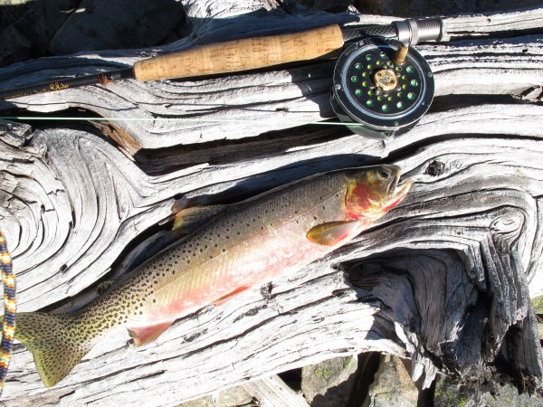 <em>Saturday, Aug. 4, 2012 -- A rainbow trout is lying on a piece of driftwood next to a fly fishing rod and reel. [vision review (ollama/qwen2.5vl:7b)]</em> -- <a href="https://www.wta.org/go-hiking/trip-reports/trip_report.2012-08-07.5841549155">https://www.wta.org/go-hiking/trip-reports/trip_report.2012-08-07.5841549155</a>

**Text mentions:**

- **Tuesday, Aug. 26, 2025** -- https://www.wta.org/go-hiking/trip-reports/trip_report-2025-08-29.180556074060
    - text ("trout"): "...l water and have lunch. There were some bugs, but they were not really a nuisance and the trout were really enjoying them. Silver Lake to Silver Pass : This section started off most..."
- **Friday, Aug. 8, 2025** -- https://www.wta.org/go-hiking/trip-reports/trip_report-2025-08-09.084259294681
    - text ("trout"): "...rt we released them all back to their bug-catching ways. We actually saw some of these 6” trout coming wholly out of the water trying to catch a passing dragonfly. The trail is mostly i..."
- **Tuesday, Aug. 13, 2024** -- https://www.wta.org/go-hiking/trip-reports/trip_report-2024-08-29.163022139625
    - text ("trout"): "...od. Blowdown along the Buckskin Lake trail, but all navigable. My friends enjoyed big trout at Buckskin...."
- **Wednesday, Jun. 30, 2021** -- https://www.wta.org/go-hiking/trip-reports/trip_report-2021-07-09-6380674591
    - text ("fishing"): "...hem on Jackita ridge. The flowers were out and we saw deer here and there. An osprey was fishing in Silver lake. A few sections had quite a few flies and mosquitoes. Headnets helped a..."
- **Tuesday, Sep. 22, 2020** -- https://www.wta.org/go-hiking/trip-reports/trip_report-2020-09-27-1672033898
    - text ("fishing"): "...ke for a few years, so I thought I'd return to see if the larch were changing and do some fishing. I chose to go mid-week to avoid crowds at the limited parking for Slate Pass and traffic..."
    - text ("fish"): "...n the last 0.6 mile to the lake. At the lake, the larch are turning gold, and the small fish are active in the evening, not so much during the day. I only caught 3 in an hour of fish..."
    - text ("fishing"): "...fish are active in the evening, not so much during the day. I only caught 3 in an hour of fishing. At the east end of the lake, the pika are building their winter caches and alerting to..."
- **Monday, Aug. 12, 2019** -- https://www.wta.org/go-hiking/trip-reports/trip_report.2019-08-19.3475603963
    - text ("fish"): "...ed. (this is mid week). Camped on a nice spot near the water and saw lots of ripples from fish jumping. This day took more effort than the first. My tracker told me it was about 8 mil..."
- **Thursday, Jul. 4, 2019** -- https://www.wta.org/go-hiking/trip-reports/trip_report.2019-07-09.8085467069
    - text ("trout"): "...he early season and trees across the trail, however, had limited their access. Lots of trout in the lake in the 6"-8" range. They were dumb and hungry enough to let a neophyte angle..."
    - text ("angler"): "...trout in the lake in the 6"-8" range. They were dumb and hungry enough to let a neophyte angler, like myself, catch (and release) a few. A climber's path goes along the southern ridge..."
- **Saturday, Jun. 22, 2019** -- https://www.wta.org/go-hiking/trip-reports/trip_report.2019-06-22.7342326752
    - text ("fish"): "...I spotted 4 marmots enroute to the lake. Silver lake itself is fairly shallow and full of fish! I saw a school of a couple of dozen hanging out doing their fish thing. I was expectin..."
    - text ("fish"): "...rly shallow and full of fish! I saw a school of a couple of dozen hanging out doing their fish thing. I was expecting to see other parties along the trail, but only past one group an..."
- **Friday, Jul. 28, 2017** -- https://www.wta.org/go-hiking/trip-reports/trip_report.2017-08-03.1450251670
    - text ("fishing"): "...oblem. This was a day hike to Silver Pass, with a stop at Silver Lake on the return for fishing. The flowers are at their prime: paintbrush, penstemon, lupine, aster, heather, and b..."
    - text ("fishing"): "...breeze. Mosquitos are bothersome at Silver Lake, requiring bug repellant.. The mid-day fishing was successful for 7"-9" trout...."
    - text ("trout"): "...at Silver Lake, requiring bug repellant.. The mid-day fishing was successful for 7"-9" trout...."
- **Friday, Jul. 21, 2017** -- https://www.wta.org/go-hiking/trip-reports/trip_report.2017-07-24.5157031684
    - text ("trout"): "...went down the steep scree/boulder slopes to Dot Lake, which was lovely and had many small trout rising to its surface. I then traversed from the lake towards a spur ridge that came off..."
- **Tuesday, Jul. 21, 2015** -- https://www.wta.org/go-hiking/trip-reports/trip_report.2015-07-24.7287504553
    - text ("fish"): "...an imposing view of the rock wall across the water. A pretty, walled-in lake, with some fish jumping. Enjoyed watching the sun’s rays lighting up the crags and crevices as night cam..."
    - text ("trout"): "...a tree. I trudged into the Hopkins Lake basin, surprised at and surprising several large trout trapped in small outflow pools. I could have caught them with my hands if I had wanted t..."
- **Thursday, Jul. 3, 2014** -- https://www.wta.org/go-hiking/trip-reports/trip_report.2014-07-09.1938641721
    - text ("fish"): "...t another gem: Lake Ferguson! The lake is in a cirque and as we ate dinner, we watched as fish rose and the sun set. Quiet, peaceful, beautiful! Day Four: Three of us decided to explor..."
- **Saturday, Aug. 4, 2012** -- https://www.wta.org/go-hiking/trip-reports/trip_report.2012-08-07.5841549155
    - text ("trout"): "...camps on either side of the Middle Fork, the nicest being on the west side. Caught a few trout, but no keepers. The next day we headed up the Buckskin Ridge Trail (the intersection is..."
    - text ("fishing"): "...ot to spend a day (or two if you have time!), with nice camps around the outlet and great fishing and swimming. The mosquitoes weren't bad as long as the breeze kept up. After a night at..."
- **Monday, Aug. 8, 2011** -- https://www.wta.org/go-hiking/trip-reports/trip_report.2011-08-18.9694150081
    - text ("fishing"): "...Pass trailhead at around 3:30pm, packs heavy with wine, liquor, inflatable rubber boats, fishing rods and real food (well, one dehydrated dinner to motivate trout catching). We arrive at..."
    - text ("trout"): "...latable rubber boats, fishing rods and real food (well, one dehydrated dinner to motivate trout catching). We arrive at Ferguson Lake four hours later, just in time to catch some settin..."
    - text ("fishing"): "...(late this year). We spent three nights and two whole days at the lake to allow for much fishing and some day hikes to the surrounding ridges and peaks (and maybe a little trundling). Th..."
- **Sunday, Jul. 19, 2009** -- https://www.wta.org/go-hiking/trip-reports/trip_report.2009-07-22.6914435404
    - text ("fishing"): "...y the view from inside your tent because outside you are fresh meat. I did enjoy a bit of fishing and caught two small trout (released them) at Silver Lake. Another highlight at Silver La..."
    - text ("trout"): "...ent because outside you are fresh meat. I did enjoy a bit of fishing and caught two small trout (released them) at Silver Lake. Another highlight at Silver Lake were the deer feeding ne..."

### Gothic Basin

https://www.wta.org/go-hiking/hikes/gothic-basin

_49 photo(s) downloaded for visual review, 3 contact sheet(s) generated._

**Fishing photos (1):**

 <em>Tuesday, Jun. 30, 2015 -- Foggy lake fishing [caption match]</em> -- <a href="https://www.wta.org/go-hiking/trip-reports/trip_report.2015-07-02.0032523077">https://www.wta.org/go-hiking/trip-reports/trip_report.2015-07-02.0032523077</a>

**Text mentions:**

- **Saturday, Nov. 8, 2025** -- https://www.wta.org/go-hiking/trip-reports/trip_report-2025-11-08.194314457958
    - text ("Salmon"): "...Sammy the Salmon Sushi here! Today I got to see Foggy Lake, it was very nice. I wonder why they call it Fo..."
    - text ("Salmon"): "...g, just a bright sunny day! Names should describe something well, like my name, Sammy the Salmon Sushi. It makes sense because I'm a Salmon Sushi. Anyway, someone left a nice Sammy size..."
    - text ("Salmon"): "...scribe something well, like my name, Sammy the Salmon Sushi. It makes sense because I'm a Salmon Sushi. Anyway, someone left a nice Sammy size flag marking the trail - thanks! I also got..."
- **Monday, Sep. 26, 2022** -- https://www.wta.org/go-hiking/trip-reports/trip_report.2022-09-26.5577618837
    - text ("pack-raft"): "...ly Foggy Lake, nestled between Gothic and Del Campo Peaks - stunning! Decided to bring my pack-raft and circumnavigate the lake, enjoying the crystal-clear waters (whoa... I can see the bot..."
    - text ("pack-raft"): "...they will save you on the descent!! :) Stats: Distance: 13.8 miles (including lake pack-raft) Duration: 7-1/4 hours (a lot of time chilling at the lake) Vertical: 3585 ft (mostly..."
    - text ("pack-raft"): "...e of year (a mild nuisance especially while paddling Foggy Lake); not sure how many folks pack-raft Foggy Lake, but there is nothing like the views and experience on the water even though t..."
- **Sunday, Aug. 14, 2022** -- https://www.wta.org/go-hiking/trip-reports/trip_report.2022-12-05.5305252381
    - text ("Trout"): "...n, a gentleman from Silver Lake showed up and was kind enough to share his freshly caught Trout with me for dinner that night! Wow! I love the mountains where folk’s inner generosity..."
- **Thursday, Aug. 8, 2019** -- https://www.wta.org/go-hiking/trip-reports/trip_report.2019-08-09.3191381351
    - text ("fisherman"): "...). It was socked in on the way up (I got in a few hours too late per other hikers and a fisherman who was on the Sauk). The fog transitioned to sprinkling on the way back down and persist..."
- **Friday, Jul. 26, 2019** -- https://www.wta.org/go-hiking/trip-reports/trip_report.2019-07-30.5552171919
    - text ("fish"): "...t soaking up the sun on the rocks at Foggy Lake and watching an osprey circle looking for fish. Saturday it rained until noon and was cloudy the rest of the day so we decided to see..."
- **Saturday, Aug. 26, 2017** -- https://www.wta.org/go-hiking/trip-reports/trip_report.2017-08-30.3346954897
    - text ("fish"): "...ke by 11am, and went fishin' until we caught one (which we did). Yes, there are plenty of fish, and yes, they really aren't all that interested in eating. Good luck. Weekends means i..."
- **Tuesday, Aug. 23, 2016** -- https://www.wta.org/go-hiking/trip-reports/trip_report.2016-08-23.0940232043
    - text ("fisherman"): "...old, but unfortunately, I didn't bring shorts with me to swim this time. FYI, if you're a fisherman, you can take your pole and catch some wild trout, I caught a few trout different sizes w..."
    - text ("trout"): "...to swim this time. FYI, if you're a fisherman, you can take your pole and catch some wild trout, I caught a few trout different sizes with rooster tail spinners. Overall, it was a grea..."
    - text ("trout"): "..., if you're a fisherman, you can take your pole and catch some wild trout, I caught a few trout different sizes with rooster tail spinners. Overall, it was a great hike and hopefully I..."
- **Monday, Aug. 1, 2016** -- https://www.wta.org/go-hiking/trip-reports/trip_report.2016-08-18.0593567487
    - text ("Fish"): "...clearest water I have ever seen. I would have jumped in if it wasn't so dang freezing!!! Fish were even jumping. Great destination for camping I can imagine. Loved this hike. It's on..."
- **Wednesday, Jul. 27, 2016** -- https://www.wta.org/go-hiking/trip-reports/trip_report.2016-07-31.5781563268
    - text ("Fish"): "...to the first waterfall crossing. This is a great (albeit sun exposed) spot for a Swedish Fish eating/water filtering break! Since water sources have been reliable on the trail, we opt..."
- **Tuesday, Jun. 30, 2015** -- https://www.wta.org/go-hiking/trip-reports/trip_report.2015-07-02.0032523077
    - text ("fishing"): "...he basin around 2pm and took another 25-30 min to get up to foggy lake. My bf brought his fishing pole and actually caught two trouts! Just caught them and released them since we overpack..."
- **Sunday, Sep. 2, 2012** -- https://www.wta.org/go-hiking/trip-reports/trip_report.2012-09-03.9300989787
    - text ("Salmon"): "...ust a few little ones on the bushes. I wonder what the bears and birds will do this fall. Salmon Chowder at Beano's made the day complete...."
- **Sunday, Sep. 20, 2009** -- https://www.wta.org/go-hiking/trip-reports/trip_report.2009-09-21.6136844501
    - text ("trout"): ".... The lake, once you reach it, is surprisingly large and deep; there are some nice-sized trout swimming in its clear blue waters. At the north end of the lake, you'll see two large sn..."
- **Saturday, Aug. 29, 2009** -- https://www.wta.org/go-hiking/trip-reports/trip_report.2009-08-30.1824386333
    - text ("fish"): "...asin for the night (one at the pond and 3 at the lake.) We spent the evening watching the fish jump and the fog roll in and out (5 or 6 times within 2 hours) In the morning we were gr..."
- **Tuesday, Sep. 18, 2007** -- https://www.wta.org/go-hiking/trip-reports/tripreport-2007091900
    - text ("fish"): "...ing the opposite curve. Innumerable picnic spots and fine camping at the east entry. Yes, fish. If Foggy Pass attracts you, choose the left coast route. Del Campo's boulder field look..."

### Cathedral Pass Loop

https://www.wta.org/go-hiking/hikes/cathedral-pass-loop

_37 photo(s) downloaded for visual review, 2 contact sheet(s) generated._

**Text mentions:**

- **Thursday, Jul. 4, 2024** -- https://www.wta.org/go-hiking/trip-reports/trip_report-2024-07-10.132613587136
    - text ("fishing"): "...ld hear rocks tumbling down the side of it the entire time we were there. And if you like fishing, my friend was catching some good sized cutthroat trout and tossing them back. Day 3:..."
    - text ("trout"): "...we were there. And if you like fishing, my friend was catching some good sized cutthroat trout and tossing them back. Day 3: Upper Cathedral to Tungsten/Chewuch Junction. Around 11...."
- **Thursday, Jul. 13, 2023** -- https://www.wta.org/go-hiking/trip-reports/trip_report.2023-07-17.5488656679
    - text ("fish"): "...t to behold. To the left is the Lower Lake, Crest the ridge to see the Upper Lake, with fish jumping and pure silence. Very few camp sites, we choose the second one and settle in. Th..."
- **Sunday, Oct. 2, 2022** -- https://www.wta.org/go-hiking/trip-reports/trip_report.2022-10-09.4608535850
    - text ("trout"): "...ght larches made for can't miss photos. One party member caught and released a nice brook trout on her third cast. We said our goodbyes as the party separated; the four of them headed b..."
- **Monday, Aug. 29, 2022** -- https://www.wta.org/go-hiking/trip-reports/trip_report.2022-09-05.5144960219
    - text ("trout"): "...ked distance: 8 miles Wildlife: (at lake) Hawks, Ravens, various, songbirds, squirrels, trout, dragonflies Bugs: Flies (non-biting) Berries: low-growth tiny huckleberries (at the..."
    - text ("Trout"): "...ish: 7385’ Tracked Elevation Gain: 696 Tracked total distance: 3.34 miles Wildlife: Trout Bugs: Flies (non-biting), some mosquitoes at lake Berries: low-growth huckleberries o..."
- **Wednesday, Jul. 6, 2022** -- https://www.wta.org/go-hiking/trip-reports/trip_report.2022-07-14.0259534604
    - text ("Fishing"): "...her up along the way toward Cathedral Pass with plenty of water all throughout the basin. Fishing at the lake was excellent. It got cold enough that night to re-freeze a good portion of t..."
- **Tuesday, Aug. 14, 2018** -- https://www.wta.org/go-hiking/trip-reports/trip_report.2018-08-17.5341329728
    - text ("trout"): "...about 8 miles up 510 before setting up my bivy sack on a large flat boulder over a small trout pond. Amused myself by killing the slow biting black flies & feeding them to the trout...."
    - text ("trout"): "...l trout pond. Amused myself by killing the slow biting black flies & feeding them to the trout. Air quality started to become an issue with the wildfire haze & smoke getting progress..."
- **Tuesday, Aug. 1, 2017** -- https://www.wta.org/go-hiking/trip-reports/trip_report.2017-08-12.6011349395
    - text ("fishing"): "...hed out. The next night I went to Lower Cathedral Lake where I was the only person. The fishing was good there but for some reason the fish were limited to 6 inches, or at least that is..."
    - text ("fish"): "...ral Lake where I was the only person. The fishing was good there but for some reason the fish were limited to 6 inches, or at least that is all I caught or saw. The next day from Low..."
    - text ("fish"): "...North side of the lake. I was going to extend my stay to three nights if I caught enough fish to feed me that long. I was going ultra-light so I brought the bare minimum of fishing g..."
- **Wednesday, Aug. 10, 2016** -- https://www.wta.org/go-hiking/trip-reports/trip_report.2016-08-15.4839555662
    - text ("fishing"): "...ing. Several mountain goats made a visit to our camp periodically throughout the day. The fishing at the lake is incredible. Tons of fish! Fly fishing is great too! Camped at the same spo..."
    - text ("fish"): "...our camp periodically throughout the day. The fishing at the lake is incredible. Tons of fish! Fly fishing is great too! Camped at the same spot Day 4: Did a little scouting over cat..."
- **Saturday, Aug. 15, 2015** -- https://www.wta.org/go-hiking/trip-reports/trip_report.2015-08-25.2122612087
    - text ("fishermen"): "...l Lake (out for a day hike), and the energetic boys from Day 1. From there, a couple of fishermen trails lead down to the lake --- one is marked with cairns; we took the other. Day 4..."
- **Sunday, Aug. 26, 2012** -- https://www.wta.org/go-hiking/trip-reports/trip_report.2012-09-03.6140461535
    - text ("fishing"): "...ne. Some of us spent more time climbing while others went back to the lake for some good fishing. I attempted to climb Cathedral Peak 8,601’ and had to stop about 100 feet short due to..."
- **Monday, Aug. 22, 2011** -- https://www.wta.org/go-hiking/trip-reports/trip_report.2011-08-27.1362463804
    - text ("trout"): "...they hiked over the valley and up the hill to get to Tungsten Lake and caught 5 cutthroat trout. On the way to Tungsten Lake, we met a park ranger lady. We talked with her a bit asking..."
    - text ("Fishing"): "...n't bother with the rain-fly. Mosquitoes were out again but not as bad as Day 1. Day 3: Fishing Heaven, Mosquito Apocalypse Next day was the easiest hiking day with only 4 miles to hike..."
    - text ("fishing"): "...emed grow in number the more we killed them. That didn't stop us from enjoying some great fishing at Cathedral Lake though. Paul casted an ultralight spinning setup and got a fish on his..."
- **Monday, Aug. 22, 2011** -- https://www.wta.org/go-hiking/trip-reports/trip_report.2011-08-27.1091531799
    - text ("trout"): "...they hiked over the valley and up the hill to get to Tungsten Lake and caught 5 cutthroat trout. On the way to Tungsten Lake, we met a park ranger lady. We talked with her a bit asking..."
    - text ("Fishing"): "...n't bother with the rain-fly. Mosquitoes were out again but not as bad as Day 1. Day 3: Fishing Heaven, Mosquito Apocalypse Next day was the easiest hiking day with only 4 miles to hike..."
    - text ("fishing"): "...emed grow in number the more we killed them. That didn't stop us from enjoying some great fishing at Cathedral Lake though. Paul casted an ultralight spinning setup and got a fish on his..."
- **Wednesday, Aug. 27, 2008** -- https://www.wta.org/go-hiking/trip-reports/tripreport-2008082803
    - text ("salmon"): "...ery easy to take the wrong way at times. The dinner menu: 1) teriyaki tri-tip 2) smoked salmon puttanesca 3) chicken and chorizo paella 4) pesto tortellini Breakfast menu: 1) oatmeal..."
    - text ("trout"): "...o paella 4) pesto tortellini Breakfast menu: 1) oatmeal 2) eggs/pancakes 3) pancakes and trout 4) fig newtons in quick snowy bailout The Libations: 5 liters Bandit cabernets and merlo..."
    - text ("fish"): "...Pass. Upper Cathedral Lake is below the pass, a beautiful spot with trees on one side and fish if you are clever enough to catch them. We found a nice camp away from the lake shore and..."
- **Sunday, Aug. 21, 2005** -- https://www.wta.org/go-hiking/trip-reports/tripreport-2005082202
    - text ("fishing"): "...for good weather on this stretch. We camp at the very pretty Upper Cathedral Lk where the fishing is good but the camps are limited. Summary: 5+ miles on easy trail for 6 hours, includin..."

### Elbow Lake

https://www.wta.org/go-hiking/hikes/elbow-lake

_27 photo(s) downloaded for visual review, 2 contact sheet(s) generated._

**Fishing photos (1):**

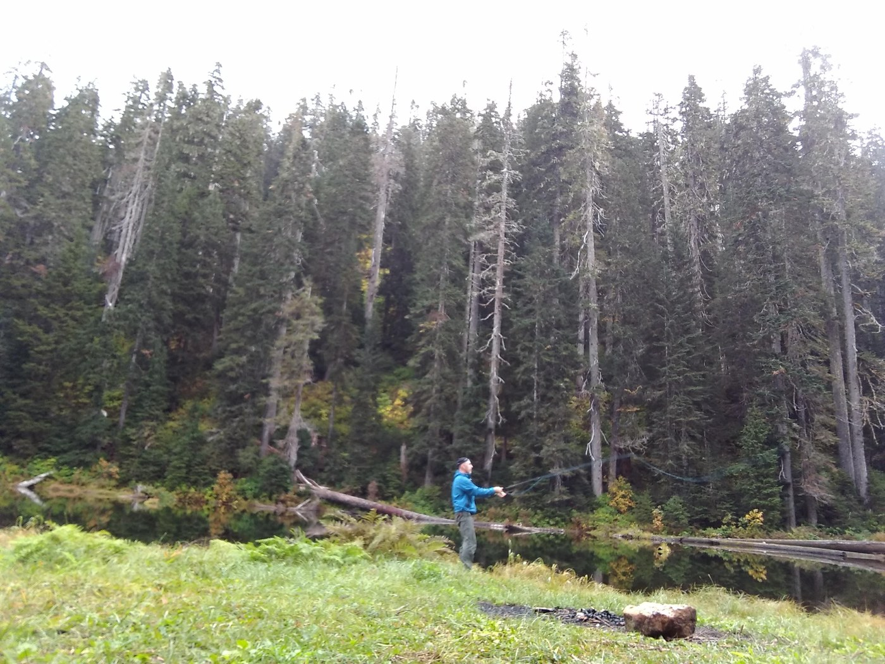 <em>Friday, Sep. 28, 2018 -- A person is fly fishing in a serene forested area with a calm lake in the background. [vision review (ollama/qwen2.5vl:7b)]</em> -- <a href="https://www.wta.org/go-hiking/trip-reports/trip_report.2018-09-30.3192663912">https://www.wta.org/go-hiking/trip-reports/trip_report.2018-09-30.3192663912</a>

**Text mentions:**

- **Friday, Jun. 13, 2025** -- https://www.wta.org/go-hiking/trip-reports/trip_report-2025-06-14.085528018711
    - text ("fish"): "...Hiked up to Elbow Lake and Lake Doreen to try and find some fish. Trail was in good condition, looked like some work had been done recently. Much apprecia..."
- **Thursday, Aug. 27, 2020** -- https://www.wta.org/go-hiking/trip-reports/trip_report-2020-08-30-7987949108
    - text ("trout"): "...ady elevation gain until you reach Elbow Lake. All in the forest. Elbow Lake has yummy trout, which were fun to catch! Here is the long version: My two older sons (13 & 12) and..."
    - text ("fishing"): "...on a large pack, I would suggest finding a different crossing. I had a large backpack on, fishing poles and gear on top, and my trekking poles strapped to my wrists. I unwisely tried t..."
    - text ("trout"): "...near the north end. We stayed at the furthest campsite (the north campsite). We caught 12 trout, enjoying 10 of them with our lunch and dinner Friday. The wild blue huckleberries were d..."
- **Friday, Sep. 28, 2018** -- https://www.wta.org/go-hiking/trip-reports/trip_report.2018-09-30.3192663912
    - text ("fly rod"): "...unny weather. There is one good, relatively dry camp sites at each of the lakes. Used a fly rod on Doreen, couldn't manage much of a cast on Elbow. Good fishing. Caught two big enough..."
    - text ("fishing"): "...h of the lakes. Used a fly rod on Doreen, couldn't manage much of a cast on Elbow. Good fishing. Caught two big enough to eat. I did manage to loose my prescription glasses and a gree..."
- **Monday, Jul. 16, 2018** -- https://www.wta.org/go-hiking/trip-reports/trip_report.2018-07-16.3554757482
    - text ("fish"): "...s, with only a cluster of three downed trees slowing the hiker. There appear to be many fish in the twin lakes. Tiny patches of snow around each lake. Scrambled to Lake Wiseman. N..."
    - text ("fish"): "...bserved -- 2 hours to travel 1 mile and 800 vertical feet through brush and low trees. No fish observed in Wiseman. Rotten ice on 5% of Lake Wiseman on July 19; no ice on July 20 -- me..."
- **Saturday, Aug. 19, 2017** -- https://www.wta.org/go-hiking/trip-reports/trip_report.2017-08-23.9240523904
    - text ("fishing"): "...ood at night because there are plenty of little mice running around too. Oh yeah, and the fishing is great! Bring an assortment of spoons and spinners and you'll have plenty of fun catchi..."
    - text ("trout"): "...great! Bring an assortment of spoons and spinners and you'll have plenty of fun catching trout. There's a full write-up in my blog on the trip for more info...."
- **Sunday, Jul. 9, 2017** -- https://www.wta.org/go-hiking/trip-reports/trip_report.2017-07-11.2198912474
    - text ("fishing"): "...ile longer. Gorgeous 11 miles up the forest service road, though. I'm coming back with my fishing pole...."
- **Friday, Aug. 26, 2016** -- https://www.wta.org/go-hiking/trip-reports/trip_report.2016-08-27.4820284743
    - text ("fish"): "...t 8.6 miles. Overall assessment: I don't recommend the Green Creek route unless you're a fish. if I did it again I would probably go farther along the Elbow Lake trail until it reache..."
- **Sunday, Jul. 12, 2015** -- https://www.wta.org/go-hiking/trip-reports/trip_report.2015-07-12.2584696230
    - text ("fish"): "...trails consider sponsoring me for hikeathon, that would be Linda Roe (that's Roe like in fish eggs): https://www.gifttool.com/athon/MyFundraisingPage?ID=1468&AID=3052&PID=515381..."
- **Monday, Jul. 21, 2014** -- https://www.wta.org/go-hiking/trip-reports/trip_report.2014-07-21.2934134821
    - text ("fish"): "...ng little Lake Doreen then onto Elbow Lake. I believe it's about 5 miles one way. Lots of fish jumping in both lakes. Passed a solo hiker on my way out. Another beautiful day in the Ca..."
- **Wednesday, Jul. 2, 2014** -- https://www.wta.org/go-hiking/trip-reports/trip_report.2014-07-02.7253880817
    - text ("fish"): "...ted with caution.still a little Patchy snow at elbow Lake.None worth worrying about.A few fish were jumping but not biting.I did get to see what II believe To believe an offsprey divin..."
    - text ("fish"): "...ot biting.I did get to see what II believe To believe an offsprey diving in the water for fish as well.With the same results as mine...."
- **Monday, Aug. 29, 2011** -- https://www.wta.org/go-hiking/trip-reports/trip_report.2011-08-31.4917066061
    - text ("fish"): "...es cut down by squirrels, one squirrel in person, elk tracks, an empty junco nest, toads, fish in Elbow Lake. Flowers are nice, but nothing spectacular. The best bit was the slope ab..."

### White Pass - Pilot Ridge Loop

https://www.wta.org/go-hiking/hikes/white-pass-pilot-ridge-loop

_24 photo(s) downloaded for visual review, 2 contact sheet(s) generated._

**Text mentions:**

- **Thursday, Jul. 24, 2025** -- https://www.wta.org/go-hiking/trip-reports/trip_report-2025-07-27.141412025592
    - text ("Fishing"): "...se vibrating their bassy calls through the forest. No bear sightings or bear trace. Fishing: Caught 6–8” rainbows in mid-elevation creeks and 8–12” cutthroats at Blue Lake - very a..."
- **Thursday, Jul. 4, 2024** -- https://www.wta.org/go-hiking/trip-reports/trip_report-2024-07-07.120726501968
    - text ("fish"): "...Lower Blue Lake was completely melted but we didn't venture down there. We saw plenty of fish jumping in Blue Lake but were not able to catch any. I figure once it's melted, the fish..."
    - text ("fish"): "...fish jumping in Blue Lake but were not able to catch any. I figure once it's melted, the fish will certainly be catchable. Had a great campsite, but the same Hover flies and mosquitos..."
- **Saturday, Jul. 8, 2023** -- https://www.wta.org/go-hiking/trip-reports/trip_report.2023-07-10.6574068771
    - text ("fish"): "...at. Perfect scenery complete with a sunset view and an inversion in the morning. Lots of fish in the very blue and very clear lake. Composting toilet is currently in great shape. Stee..."
- **Monday, Aug. 22, 2022** -- https://www.wta.org/go-hiking/trip-reports/trip_report.2022-09-02.5850927589
    - text ("fish"): "...horoughly enjoyed wandering through the two little ponds below the lake, being watched by fish who didn't seem to find a human being threatening. I did want to point out that there w..."
- **Friday, Aug. 7, 2020** -- https://www.wta.org/go-hiking/trip-reports/trip_report-2020-08-11-5117975814
    - text ("fish"): "...tely melted out with just a few tiny little snow spots on the far shores. Lots of little fish jumping. Ample camping at the lake and a privy. I took a QUICK dip into the lake. It m..."
- **Friday, Jul. 24, 2020** -- https://www.wta.org/go-hiking/trip-reports/trip_report-2020-08-06-4769541726
    - text ("fishing"): "...lil buggy that night....but sometimes its worth it....at that altitude, a bald eagle was fishing at lower Blue Lake!.. watched it in fading light miss on a pass, turn and fly within 50 f..."
- **Thursday, Aug. 8, 2019** -- https://www.wta.org/go-hiking/trip-reports/trip_report.2019-08-09.3090091921
    - text ("Trout"): "...akes are gorgeous and incredibly clear. Swimmable temp by alpine lake standards. So blue. Trout, fishing birds of prey, and an amazing hillside backdrop to ponder through a long day of..."
- **Saturday, Aug. 19, 2017** -- https://www.wta.org/go-hiking/trip-reports/trip_report.2017-08-23.9956560117
    - text ("trout"): "...ith a glorious, clear, deep blue color that is absolutely breathtaking. The hubs caught a trout that was stuck in some sticks in the outflow from the lake, and returned it to the main l..."
- **Friday, Jul. 28, 2017** -- https://www.wta.org/go-hiking/trip-reports/trip_report.2017-08-03.9788350422
    - text ("trout"): "...warmer and would have been more pleasant for swimming. We saw a ton of tadpoles and a few trout, and hung out for a little while to filter water. The trail on this day wasn't bad until..."
- **Friday, Aug. 16, 2013** -- https://www.wta.org/go-hiking/trip-reports/trip_report.2013-08-21.7968417482
    - text ("fishing"): "...Pilot Ridge. We had a leisurely six days to do this allowing lots of side trips with some fishing thrown in. The North Fork Sauk trail is very nice with lots of huge trees and open forest..."

### Beaver Lake

https://www.wta.org/go-hiking/hikes/beaver-lake-1

_22 photo(s) downloaded for visual review, 2 contact sheet(s) generated._

**Fishing photos (1):**

 <em>Saturday, Oct. 7, 2023 -- You can see the salmon here [caption match]</em> -- <a href="https://www.wta.org/go-hiking/trip-reports/trip_report.2023-10-07.2211053623">https://www.wta.org/go-hiking/trip-reports/trip_report.2023-10-07.2211053623</a>

**Text mentions:**

- **Tuesday, Jun. 25, 2024** -- https://www.wta.org/go-hiking/trip-reports/trip_report-2024-06-26.070339586622
    - text ("fish"): "...me to make it clear where the trail is, but it needs more work. In the Fall lots of dead fish heads have been observed near the washed-out section. This is now a slow flowing side br..."
    - text ("fishing"): "...ved near the washed-out section. This is now a slow flowing side branch to the river and fishing must be easy...."
- **Saturday, Oct. 7, 2023** -- https://www.wta.org/go-hiking/trip-reports/trip_report.2023-10-07.2211053623
    - text ("salmon"): "...The salmon are spawning and easy to see on this little hike! This is a hike about the journey, as th..."
    - text ("fish"): "...this. Great fall color today and only 4 other people on trail. We could smell the rotting fish all along the trail by the river, so we were hoping to see live spawning fish. We were ab..."
    - text ("fish"): "...the rotting fish all along the trail by the river, so we were hoping to see live spawning fish. We were able to get a good look just after the little switchback as the trail goes down..."
- **Saturday, Feb. 26, 2022** -- https://www.wta.org/go-hiking/trip-reports/trip_report-2022-03-03-8233973854
    - text ("fish"): "...farther. Much to my chagrin, my dog was even more ecstatic to make it to the river. Dead fish are still accessible to the trained nose. He also found some other "treasures" along the..."
- **Sunday, Nov. 29, 2020** -- https://www.wta.org/go-hiking/trip-reports/trip_report-2020-11-29-6963521953
    - text ("salmon"): "...l want boots. We saw 2 eagles hanging out along the river, and we could smell why, a dead salmon along the bank. Nice views of Mt Pugh once the fog cleared off. It is sad to see the bri..."
- **Sunday, Nov. 22, 2020** -- https://www.wta.org/go-hiking/trip-reports/trip_report-2020-11-22-5113069755
    - text ("fish"): "...rail continues, eventually reaching a channel of the Sauk River. The water was alive with fish, big and smaller, Bald and other eagles overhead. I walked gently across the channel, up..."
- **Friday, Jul. 14, 2017** -- https://www.wta.org/go-hiking/trip-reports/trip_report.2017-07-15.9846115653
    - text ("fishing"): "...you reach the lake, which I didn't find terribly impressive. A couple of guys were there fishing with their dog. Bugs were awful despite spraying ourselves down a couple times. Beautiful..."
- **Sunday, Jul. 26, 2015** -- https://www.wta.org/go-hiking/trip-reports/trip_report.2015-07-27.0229289628
    - text ("fishing"): "...Went up with 15, 8 and 5 year old children. Packed in a small fishing kit. Fished about 35 feet beyond eastern end of bridge. Caught 3 nice little Eastern Broo..."
    - text ("Trout"): "...it. Fished about 35 feet beyond eastern end of bridge. Caught 3 nice little Eastern Brook Trout. Very nice surprise! The trail is always best during the summer when the trail is not sop..."
- **Sunday, Jan. 11, 2015** -- https://www.wta.org/go-hiking/trip-reports/trip_report.2015-01-12.0219808018
    - text ("salmon"): "...abrupt and soft. Watch kids along this section. The alders, mosses & lichen, the reddish salmon-berry stalks and the lovely turquoise of the river made for a colorful walk.The beavers h..."
- **Sunday, Oct. 2, 2011** -- https://www.wta.org/go-hiking/trip-reports/trip_report.2011-10-03.7089767898
    - text ("fish"): "...trail we saw many tiny frogs. They were everywhere. The kids really enjoyed that. We saw fish in the river (must have been spawning salmon). And suprisingly off in the distance, I saw..."
    - text ("salmon"): "...erywhere. The kids really enjoyed that. We saw fish in the river (must have been spawning salmon). And suprisingly off in the distance, I saw a beaver at the pond. One very unpleasant t..."

### Silver Lake - Monte Cristo

https://www.wta.org/go-hiking/hikes/silver-lake-3

_27 photo(s) downloaded for visual review, 2 contact sheet(s) generated._

**Fishing photos (2):**

 <em>Tuesday, Sep. 6, 2022 -- A fishing line holds four rainbow trout above a serene lake with rocky cliffs and trees in the background. [vision review (ollama/qwen2.5vl:7b)]</em> -- <a href="https://www.wta.org/go-hiking/trip-reports/trip_report.2022-09-08.2325490914">https://www.wta.org/go-hiking/trip-reports/trip_report.2022-09-08.2325490914</a>

 <em>Monday, Sep. 20, 2021 -- A freshly caught fish lies on a mossy rock, with a fishing lure still attached to its mouth. [vision review (ollama/qwen2.5vl:7b)]</em> -- <a href="https://www.wta.org/go-hiking/trip-reports/trip_report-2021-09-26-2232515585">https://www.wta.org/go-hiking/trip-reports/trip_report-2021-09-26-2232515585</a>

**Text mentions:**

- **Thursday, Jul. 17, 2025** -- https://www.wta.org/go-hiking/trip-reports/trip_report-2025-07-22.232323146964
    - text ("fishing"): "...ound the lake trying to find a trail that lead to the lower lake as it is an overabundant fishing lake and we wanted to catch some brook trout. We reached a lot of dead ends of forgotten..."
    - text ("trout"): "...to the lower lake as it is an overabundant fishing lake and we wanted to catch some brook trout. We reached a lot of dead ends of forgotten trails but after some back tracking we made i..."
    - text ("fish"): "...ed like they haven't seen visitors in years. We found a great spot to hang out and caught fish on almost every cast. It was amazing! The lower lake wasn't quite as stunning as the upp..."
- **Tuesday, Sep. 6, 2022** -- https://www.wta.org/go-hiking/trip-reports/trip_report.2022-09-08.2325490914
    - text ("fishing"): "...I went out to the Twin Lakes for an overnight fishing trip. The trailhead at Barlow Pass was emptying out when I arrived the morning after Lab..."
    - text ("fishing"): "...camps, but there is lots of camping on The north end, too. Once in camp I busted out my fishing pole and planted myself by the lake for the afternoon and evening. I caught my limit in..."
    - text ("fish"): "...fternoon and evening. I caught my limit in just a few hours and had them chilling on the fish stringer waiting for breakfast. I slept under the stars that night and woke up to find m..."
- **Sunday, Aug. 14, 2022** -- https://www.wta.org/go-hiking/trip-reports/trip_report.2022-12-05.5305252381
    - text ("Trout"): "...n, a gentleman from Silver Lake showed up and was kind enough to share his freshly caught Trout with me for dinner that night! Wow! I love the mountains where folk’s inner generosity..."
- **Saturday, Aug. 13, 2022** -- https://www.wta.org/go-hiking/trip-reports/trip_report.2022-08-15.6835116977
    - text ("fish"): "...f lake, I continued on side semi-bush whacking on south side of lake. Beautiful lake with fish jumping. Heading back, was VERY slow and at crest, I thought I might be off trail (I'm SU..."
- **Monday, Sep. 20, 2021** -- https://www.wta.org/go-hiking/trip-reports/trip_report-2021-09-26-2232515585
    - text ("fishing"): "...p to the east which you will probably notice on the way in. Chores done, I busted out my fishing pole and went to invite the local trout to dinner (muwahaha!). The established campsite..."
    - text ("trout"): "...ce on the way in. Chores done, I busted out my fishing pole and went to invite the local trout to dinner (muwahaha!). The established campsite by the lake outlet is a perfect spot to..."
    - text ("fish"): "...to dinner (muwahaha!). The established campsite by the lake outlet is a perfect spot to fish from the shore. I caught 6 rainbow trout while I was out there, 2 of which ended up in t..."
- **Sunday, Aug. 9, 2020** -- https://www.wta.org/go-hiking/trip-reports/trip_report-2020-08-11-2342253147
    - text ("anglers"): "...on the beach below the Columbia Peak boulder field. There was only one other party: three anglers camped at the lakes that brought along an inflatable boat. Sweet! The night was cool an..."
- **Saturday, Aug. 19, 2017** -- https://www.wta.org/go-hiking/trip-reports/trip_report.2018-07-12.3907049781
    - text ("trout"): "...tiful, recent history, thigh-burning gain, and some more beauty. there's even some hungry trout in the lakes - I caught four myself. I'll start by saying my GPS said I put in a total o..."
- **Saturday, Aug. 12, 2017** -- https://www.wta.org/go-hiking/trip-reports/trip_report.2017-08-16.0837833896
    - text ("fish"): "...the trip, currently the blueberries are out and they were a nice little snack! We did not fish but another party at the upper lake said fishing was hot that day. Enjoy!..."
    - text ("fishing"): "...d they were a nice little snack! We did not fish but another party at the upper lake said fishing was hot that day. Enjoy!..."
- **Saturday, Aug. 5, 2017** -- https://www.wta.org/go-hiking/trip-reports/trip_report.2017-08-07.6790724089
    - text ("fish"): "...n sketchy exposed sections. Might not be needed for a day hike. Twin Lakes had TONS of fish, some 8-10 inches long by my estimate, and they were very active all day long. It was co..."

### Big Beaver Trail

https://www.wta.org/go-hiking/hikes/big-beaver

_15 photo(s) downloaded for visual review, 1 contact sheet(s) generated._

**Text mentions:**

- **Monday, Aug. 25, 2025** -- https://www.wta.org/go-hiking/trip-reports/trip_report-2025-08-30.142958912477
    - text ("fishing"): "...hree creeks along the way was dry. We were in the water a few times each day, snorkeling, fishing, exploring, swimming. Tentsites only partially filled leaving lots of privacy. Encountere..."
- **Tuesday, Aug. 16, 2022** -- https://www.wta.org/go-hiking/trip-reports/trip_report.2022-08-27.4644091863
    - text ("fish"): "...th easy access for swimming Heard elk bugle a few times across the lake and saw several fish jumping. Magical site- absolutely on my list of places to come back to! Day 5 - hozom..."
- **Saturday, May. 18, 2019** -- https://www.wta.org/go-hiking/trip-reports/trip_report.2019-05-21.2116186190
    - text ("fish"): "...o low right now but fun to explore. And as the previous report said, keep an eye out for fish hooks if you're exploring the lake bed barefoot...."
- **Saturday, May. 4, 2019** -- https://www.wta.org/go-hiking/trip-reports/trip_report.2019-05-07.6844038533
    - text ("fishing"): "...a carved-out canyon. Despite the sandy dunes, I wouldn't go barefoot here--we found many fishing lures hiding in the sand we brought back to discard. Elk and raccoon prints in the sand w..."
- **Saturday, Aug. 16, 2014** -- https://www.wta.org/go-hiking/trip-reports/trip_report.2014-08-17.1694099102
    - text ("salmon"): "...iwack River: a bit of brush and blowdown, but nothing too onerous; mostly step-overs. The salmon are running in Indian Creek, the first ford, and the fording routes are flagged. Not very..."
- **Saturday, May. 25, 2013** -- https://www.wta.org/go-hiking/trip-reports/trip_report.2013-05-27.3593331484
    - text ("fishing"): "...and delicious. There aren't any berries on the trip yet though so bring enough food, and fishing is closed at the moment. (I believe early June it opens but PLEASE check the regs before..."
    - text ("fishing"): "...is closed at the moment. (I believe early June it opens but PLEASE check the regs before fishing. It is in a National Park so don't break the rules). Wildflowers were blooming and the fo..."
- **Sunday, Aug. 28, 2011** -- https://www.wta.org/go-hiking/trip-reports/trip_report.2011-09-04.5488361676
    - text ("fish"): "...wouldn’t see any other people for the next 48 hours. I packed my fly-rod and planned to fish the two creeks, but the trail does not go very near Little Beaver for the first 4 miles...."
    - text ("fishing"): "...the trailhead. After about 7 miles, the creek was more accessible with some good-looking fishing holes, but I felt like I needed to push on to the campsite. The Stillwell Camp is spread..."
    - text ("trout"): "...cely a few hundred yards off the trail on a bank above the creek. I caught a couple small trout here. The bugs disappeared at dusk. The next morning I headed over Beaver Pass toward my..."
- **Friday, Jun. 4, 2010** -- https://www.wta.org/go-hiking/trip-reports/trip_report.2010-06-15.3992015781
    - text ("fly fishing"): "...e up to the pass to see how far we could get. Big Beaver TH has a lovely lakeshore camp (fly fishing might be excellent?) at 1800' elevation with great views of surrounding peaks, but we set..."
- **Thursday, Jul. 4, 2002** -- https://www.wta.org/go-hiking/trip-reports/tripreport-2002070525
    - text ("fishing"): "...left early and the last mile from the dam to the hwy is no fun in the sun! P.S. read your fishing regs or it will cost you as well...."

### Boulder Lake

https://www.wta.org/go-hiking/hikes/boulder-lake-mountain-loop-highway

_12 photo(s) downloaded for visual review, 1 contact sheet(s) generated._

**Text mentions:**

- **Friday, Sep. 19, 2025** -- https://www.wta.org/go-hiking/trip-reports/trip_report-2025-09-20.094733959373
    - text ("fish"): "...ot easily seen trail that requires, at times, some navigation skills. Nice hike, lots of fish jumping, and some last of the season blueberries...."
- **Monday, Jul. 28, 2025** -- https://www.wta.org/go-hiking/trip-reports/trip_report-2025-07-31.142124773312
    - text ("fish"): "...more rocks to access campsites. The lake is very pretty, with what looks like plenty of fish. I watched an otter in the morning going out for breakfast. After my own breakfast, I set..."
- **Saturday, Aug. 13, 2022** -- https://www.wta.org/go-hiking/trip-reports/trip_report.2022-08-16.2819091465
    - text ("fishing"): "...re out at the lake. Lots of traffic, many day hikers, every group of overnighters brought fishing poles. The fish are decent sized and healthy, after gutting/fileting many people leave th..."
    - text ("fish"): "...ng/fileting many people leave the carcass on shore or toss into the shallows. Guess what, fish carcasses everywhere means more flies,scavengers and stink. Bury or fully burn carcasses/..."
- **Friday, Jul. 27, 2018** -- https://www.wta.org/go-hiking/trip-reports/trip_report.2018-08-01.5948482057
    - text ("fishing"): "...out through a boulder field on the right. The mosquitoes and flies were terrible, but the fishing was on point with cutthroats up to 16 inches taking the bait. There is ample water on the..."
    - text ("fishing"): "...on the way down in 90 degree heat both ways. Also, if anyone lost the handle off their fishing reel in the heavy brush, send me a message and I can get it back to you...."
- **Wednesday, Jul. 8, 2015** -- https://www.wta.org/go-hiking/trip-reports/trip_report.2015-07-08.9468402572
    - text ("fish"): "...e lake was pristine and the surrounding mountains views were outstanding. We caught a few fish and went for a swim. Quite refreshing. We only saw three other people. I don't think this..."
- **Tuesday, Jun. 16, 2015** -- https://www.wta.org/go-hiking/trip-reports/trip_report.2015-06-17.3440702127
    - text ("fishing"): "...sure. Great weather. Went on to Pear lake for the first time. Absolutely stunning!! Great fishing to top it off...."
- **Friday, Aug. 17, 2001** -- https://www.wta.org/go-hiking/trip-reports/tripreport-2001081803
    - text ("Fishing"): ".... Beginning of trail is very brushy, once in timber travel is much easier."" is accurate. Fishing is poor, if that is your intent. Bring a trash bag and help clean up by packing out some..."
- **Tuesday, Jul. 3, 2001** -- https://www.wta.org/go-hiking/trip-reports/tripreport-2001070423
    - text ("fishing"): "...throwing. Pear Lake is 250' above, both are snowed in. Wait a few weeks, then bring your fishing pole. Stats: 7 miles R/T, 2110' gain, 2:30 up, 1:40 down. This is a wild path!..."
- **Saturday, Jul. 17, 1999** -- https://www.wta.org/go-hiking/trip-reports/tripreport-1999071809
    - text ("fishing"): "...I was going to try my luck fishing Boulder Lake off the Suiattle River road. I knew I was being a little optimistic because..."
    - text ("fishing"): "...only to find out it was 99 percent snow covered. I'd give it a good 2-3 weeks before any fishing is possible...."

### Boundary Trail - Pasayten

https://www.wta.org/go-hiking/hikes/boundary-trail-1

_12 photo(s) downloaded for visual review, 1 contact sheet(s) generated._

**Text mentions:**

- **Thursday, Jul. 3, 2025** -- https://www.wta.org/go-hiking/trip-reports/trip_report-2025-07-07.081523937992
    - text ("fishing"): "...Lakes. Hiking the burnout of the Chewuch trail isn't very interesting but it's fantastic fishing in the river. The bugs were bad up at the Cathedral Lakes, but are better on the passes...."
- **Thursday, Aug. 22, 2024** -- https://www.wta.org/go-hiking/trip-reports/trip_report-2024-07-18.111624594105
    - text ("Trout"): "...S: • PCT #2000 Between Grasshopper Pass and Rainy Pass • West Fork Methow Trail #480 From Trout Creek to PCT Tr. #2000 • Cutthroat Tr. #483 is Closed beyond Cutthroat Lake • Easy Pass T..."
- **Monday, Aug. 12, 2019** -- https://www.wta.org/go-hiking/trip-reports/trip_report.2019-08-21.7241644122
    - text ("fish"): "...inner there. Glad we did not camp there as it is not very central for our exploring. NICE fish in the lake though, we met a couple guys who had been fishing and were hooking decent rai..."
    - text ("fishing"): "...entral for our exploring. NICE fish in the lake though, we met a couple guys who had been fishing and were hooking decent rainbows. HUGE electrical storm that night, thunder and lighting,..."
- **Saturday, Aug. 15, 2015** -- https://www.wta.org/go-hiking/trip-reports/trip_report.2015-08-25.2122612087
    - text ("fishermen"): "...l Lake (out for a day hike), and the energetic boys from Day 1. From there, a couple of fishermen trails lead down to the lake --- one is marked with cairns; we took the other. Day 4..."
- **Saturday, Jul. 28, 2012** -- https://www.wta.org/go-hiking/trip-reports/trip_report.2012-08-20.2875625694
    - text ("fish"): "...ain Lodge. We saw many deer and all of the lakes we passed or camped at were loaded with fish. Weather was great, mosquitoes and flies were pretty minimal, and wildflowers were in fu..."
    - text ("fishing"): "...s of options to just camp wherever you’d like. The big draw to the area is the excellent fishing in the Lost River and Hidden Lakes. The fish are reported to be thick and up to 27 inche..."
    - text ("fish"): "...he big draw to the area is the excellent fishing in the Lost River and Hidden Lakes. The fish are reported to be thick and up to 27 inches. Fishing it is easier with a raft. There a..."
- **Monday, Aug. 22, 2011** -- https://www.wta.org/go-hiking/trip-reports/trip_report.2011-08-27.1362463804
    - text ("trout"): "...they hiked over the valley and up the hill to get to Tungsten Lake and caught 5 cutthroat trout. On the way to Tungsten Lake, we met a park ranger lady. We talked with her a bit asking..."
    - text ("Fishing"): "...n't bother with the rain-fly. Mosquitoes were out again but not as bad as Day 1. Day 3: Fishing Heaven, Mosquito Apocalypse Next day was the easiest hiking day with only 4 miles to hike..."
    - text ("fishing"): "...emed grow in number the more we killed them. That didn't stop us from enjoying some great fishing at Cathedral Lake though. Paul casted an ultralight spinning setup and got a fish on his..."

### Copper Ridge

https://www.wta.org/go-hiking/hikes/copper-ridge

_22 photo(s) downloaded for visual review, 2 contact sheet(s) generated._

**Fishing photos (2):**

 <em>Thursday, Aug. 21, 2014 -- Spawning Salmon [caption match]</em> -- <a href="https://www.wta.org/go-hiking/trip-reports/trip_report.2014-09-01.5660043271">https://www.wta.org/go-hiking/trip-reports/trip_report.2014-09-01.5660043271</a>

 <em>Friday, Aug. 24, 2012 -- Spawning salmon in the Chilliwack [caption match]</em> -- <a href="https://www.wta.org/go-hiking/trip-reports/trip_report.2012-08-28.5710556993">https://www.wta.org/go-hiking/trip-reports/trip_report.2012-08-28.5710556993</a>

**Text mentions:**

- **Thursday, Aug. 18, 2022** -- https://www.wta.org/go-hiking/trip-reports/trip_report.2022-08-24.0922809971
    - text ("salmon"): "...thing major before crossing the Chilliwack, and flagging was easy to spot. We watched the salmon work as hard as they could get swim upstream for a bit, then switched into Tevas to get a..."
- **Saturday, Jul. 24, 2021** -- https://www.wta.org/go-hiking/trip-reports/trip_report-2021-07-25-5304324028
    - text ("fish"): "...were going to camp at Egg lake and had finishing rods with them. Didn't know egg lake had fish. Views from Silesia campground are great and keeps on getting better. The last section..."
- **Thursday, Jul. 28, 2016** -- https://www.wta.org/go-hiking/trip-reports/trip_report.2016-08-01.3604276114
    - text ("salmon"): "...the other side, but follow the markers to a wide log bridge. We counted dozens of sockeye salmon hanging out in the clear water below. So pink, so … weird. A fallen tree took out the sig..."
- **Thursday, Aug. 21, 2014** -- https://www.wta.org/go-hiking/trip-reports/trip_report.2014-09-01.5660043271
    - text ("salmon"): "...hat was it. I debated the next morning between hiking to Whatcom Pass or to the spawning salmon. I wasn't sure where along the trail I would find the salmon, but I knew they were there,..."
    - text ("salmon"): "...tcom Pass or to the spawning salmon. I wasn't sure where along the trail I would find the salmon, but I knew they were there, somewhere. I chose the salmon. Not too far along the trail..."
    - text ("salmon"): "...ong the trail I would find the salmon, but I knew they were there, somewhere. I chose the salmon. Not too far along the trail I came upon the cablecar river crossing. I'm not a big heig..."
- **Saturday, Aug. 16, 2014** -- https://www.wta.org/go-hiking/trip-reports/trip_report.2014-08-17.1694099102
    - text ("salmon"): "...iwack River: a bit of brush and blowdown, but nothing too onerous; mostly step-overs. The salmon are running in Indian Creek, the first ford, and the fording routes are flagged. Not very..."
- **Friday, Aug. 24, 2012** -- https://www.wta.org/go-hiking/trip-reports/trip_report.2012-08-28.5710556993
    - text ("Salmon"): "...t on Copper Ridge right now - just a few patches you have to cross, but nothing serious. Salmon are spawning right now at the Chilliwack River crossing, and while a little stinky, they..."

### Ross Dam Trail

https://www.wta.org/go-hiking/hikes/ross-dam-trail

_10 photo(s) downloaded for visual review, 1 contact sheet(s) generated._

**Fishing photos (1):**

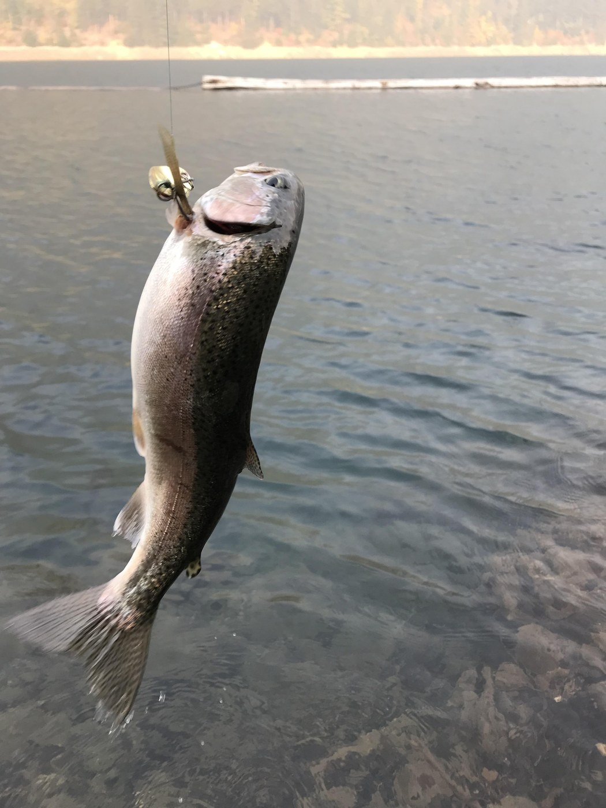 <em>Sunday, Oct. 9, 2022 -- A fish is hanging from a fishing line against a backdrop of a calm body of water. [vision review (ollama/qwen2.5vl:7b)]</em> -- <a href="https://www.wta.org/go-hiking/trip-reports/trip_report.2022-10-10.9219929645">https://www.wta.org/go-hiking/trip-reports/trip_report.2022-10-10.9219929645</a>

**Text mentions:**

- **Monday, Aug. 25, 2025** -- https://www.wta.org/go-hiking/trip-reports/trip_report-2025-08-30.142958912477
    - text ("fishing"): "...hree creeks along the way was dry. We were in the water a few times each day, snorkeling, fishing, exploring, swimming. Tentsites only partially filled leaving lots of privacy. Encountere..."
- **Saturday, Aug. 16, 2025** -- https://www.wta.org/go-hiking/trip-reports/trip_report-2025-08-17.094438905274
    - text ("fish"): "...d waterfalls plus the mossy boulders and lake views make it great. I took my raft down to fish the lake, but the cooler, stormy weather of the last few days sent the fish into hiding...."
    - text ("fish"): "...raft down to fish the lake, but the cooler, stormy weather of the last few days sent the fish into hiding. The lake is beautiful though. Lots of people were on the trail today...."
- **Sunday, Oct. 9, 2022** -- https://www.wta.org/go-hiking/trip-reports/trip_report.2022-10-10.9219929645
    - text ("fishing"): "...il today for the first time. It's been on my list for quite a while and I was in the area fishing anyway. Trail is in good condition, if a bit dusty. Smoke is definitely there, but not as..."
    - text ("fish"): "...miles away. I made it down quickly and went towards the boat launch instead of the dam to fish along the "shore", it was all scree slopes but worth it because I caught some huge trout...."
    - text ("trout"): "...o fish along the "shore", it was all scree slopes but worth it because I caught some huge trout. A couple guys were carrying canoes up the trail, I wouldn't recommend that unless you're..."
- **Tuesday, Aug. 16, 2022** -- https://www.wta.org/go-hiking/trip-reports/trip_report.2022-08-27.4644091863
    - text ("fish"): "...th easy access for swimming Heard elk bugle a few times across the lake and saw several fish jumping. Magical site- absolutely on my list of places to come back to! Day 5 - hozom..."
- **Saturday, May. 18, 2019** -- https://www.wta.org/go-hiking/trip-reports/trip_report.2019-05-21.2116186190
    - text ("fish"): "...o low right now but fun to explore. And as the previous report said, keep an eye out for fish hooks if you're exploring the lake bed barefoot...."

### Bridge Creek - McAlester Pass to Stehekin

https://www.wta.org/go-hiking/hikes/bridge-creek

_10 photo(s) downloaded for visual review, 1 contact sheet(s) generated._

**Text mentions:**

- **Sunday, Jul. 27, 2025** -- https://www.wta.org/go-hiking/trip-reports/trip_report-2025-08-04.232433710034
    - text ("fly fishing"): "...o the Bridge creek camp early and were rewarded by a lazy afternoon of crisp swimming and fly fishing here...."
- **Sunday, Jul. 7, 2019** -- https://www.wta.org/go-hiking/trip-reports/trip_report.2019-07-07.9982360444
    - text ("trout"): "...but didn't bother me at all, especially once we got the fire going. The lake had LOTS of trout rising. Saw one deer in the camp site. The next day on 7/4 we proceeded the last 500 fe..."
- **Monday, Jul. 16, 2018** -- https://www.wta.org/go-hiking/trip-reports/trip_report.2018-07-29.6991524969
    - text ("trout"): "...ion Gain: 2000 ft. Day 3 was a rest day at McAlester Lake. My daughter caught a rainbow trout for breakfast, and we did our best to cut weight by eating extra Mountain House. We had h..."
    - text ("salmon"): "...d up by boat from Chelan) at the restaurant at the landing. I let my daughter order a $28 salmon filet and bought her a few souvenirs from the shop there, but hey, she earned it. We slep..."
- **Friday, Jul. 5, 2013** -- https://www.wta.org/go-hiking/trip-reports/trip_report.2013-07-13.8306598178
    - text ("fly fishing"): "...rward until reaching Bench Creek Campground. We stopped a bit at McAlester Lake for some fly fishing and a dip, but moved on quickly due to overwhelming mosquitos. The mosquitos were still..."

### Snowking Mountain

https://www.wta.org/go-hiking/hikes/snowking

_4 photo(s) downloaded for visual review, 1 contact sheet(s) generated._

**Text mentions:**

- **Saturday, Aug. 19, 2017** -- https://www.wta.org/go-hiking/trip-reports/trip_report.2017-08-30.0189411031
    - text ("fish"): "...since it was flatter. The water is a beautiful cerulean blue color and there were lots of fish jumping. Our dog Lola enjoyed swimming and John caught a couple fish. The next day..."
    - text ("fish"): "...d there were lots of fish jumping. Our dog Lola enjoyed swimming and John caught a couple fish. The next day we were headed for Neori, Skaro and Snowking lakes so we went back to..."
    - text ("fish"): "...hill near the end of it. Snowking lake is a beautiful turquoise glacial lake with tons of fish and privacy. There isn’t great camping right next to the lake but about 50ft away there i..."
- **Friday, Jul. 23, 2004** -- https://www.wta.org/go-hiking/trip-reports/tripreport-2004072423
    - text ("fish"): "...Since I could see all the way to the bottom of this lakelet, I was fairly certain that no fish survive within it. I was hoping to have an ice-cold bottle of Gatorade, but the water I d..."
- **Friday, Apr. 26, 2002** -- https://www.wta.org/go-hiking/trip-reports/tripreport-2002042701
    - text ("fisherman"): "...continues to roughly follow just east of the creek. it is still steep, a classic climber/fisherman trail with no switchbacks, easy to loose in places especially with partial snow-cover. At..."

### Little Beaver Creek

https://www.wta.org/go-hiking/hikes/little-beaver-creek

_7 photo(s) downloaded for visual review, 1 contact sheet(s) generated._

**Text mentions:**

- **Tuesday, Aug. 16, 2022** -- https://www.wta.org/go-hiking/trip-reports/trip_report.2022-08-27.4644091863
    - text ("fish"): "...th easy access for swimming Heard elk bugle a few times across the lake and saw several fish jumping. Magical site- absolutely on my list of places to come back to! Day 5 - hozom..."
- **Saturday, Aug. 16, 2014** -- https://www.wta.org/go-hiking/trip-reports/trip_report.2014-08-17.1694099102
    - text ("salmon"): "...iwack River: a bit of brush and blowdown, but nothing too onerous; mostly step-overs. The salmon are running in Indian Creek, the first ford, and the fording routes are flagged. Not very..."
- **Sunday, Aug. 28, 2011** -- https://www.wta.org/go-hiking/trip-reports/trip_report.2011-09-04.5488361676
    - text ("fish"): "...wouldn’t see any other people for the next 48 hours. I packed my fly-rod and planned to fish the two creeks, but the trail does not go very near Little Beaver for the first 4 miles...."
    - text ("fishing"): "...the trailhead. After about 7 miles, the creek was more accessible with some good-looking fishing holes, but I felt like I needed to push on to the campsite. The Stillwell Camp is spread..."
    - text ("trout"): "...cely a few hundred yards off the trail on a bank above the creek. I caught a couple small trout here. The bugs disappeared at dusk. The next morning I headed over Beaver Pass toward my..."

### Vesper Peak

https://www.wta.org/go-hiking/hikes/vesper-peak

_8 photo(s) downloaded for visual review, 1 contact sheet(s) generated._

**Text mentions:**

- **Saturday, Aug. 26, 2023** -- https://www.wta.org/go-hiking/trip-reports/trip_report.2023-08-29.0215675116
    - text ("fishing"): "...swim. The water is cold! but quite refreshing. I saw some guy skinny dipping, and someone fishing. There were a few others around the lake. People were camping near the lake as well. When..."
- **Saturday, Aug. 1, 2020** -- https://www.wta.org/go-hiking/trip-reports/trip_report-2020-08-02-9818736669
    - text ("Fish"): "...summit but instead chatted with the climbers (from a distance) who were ascending up the "Fish & Whistle" route. Dumbass me, I forgot my rain pants back in the car, so I was debating..."

### Mudhole Lake

https://www.wta.org/go-hiking/hikes/mudhole-lake

_8 photo(s) downloaded for visual review, 1 contact sheet(s) generated._

**Text mentions:**

- **Sunday, Jun. 14, 2026** -- https://www.wta.org/go-hiking/trip-reports/trip_report-2026-06-25.110103513374
    - text ("fishing"): "...le for possibility of moving rocks/using hands. Varden Lake is much more appropriate for fishing/swimming than Mudhole Lake, but there are limited camping options. In mid-June following..."
- **Sunday, Jun. 16, 2019** -- https://www.wta.org/go-hiking/trip-reports/trip_report.2019-06-17.3380174757
    - text ("salmon"): "...through a ravine and an ephemeral stream. There was western redcedar, end of bloom false-salmon seal, and lust Oregon boxwood. The trail then transition to a whole series of somewhat..."

### Headlee Pass and Vesper Lake

https://www.wta.org/go-hiking/hikes/headlee-pass-and-vesper-lake

_4 photo(s) downloaded for visual review, 1 contact sheet(s) generated._

**Text mentions:**

- **Saturday, Aug. 1, 2020** -- https://www.wta.org/go-hiking/trip-reports/trip_report-2020-08-02-9818736669
    - text ("Fish"): "...summit but instead chatted with the climbers (from a distance) who were ascending up the "Fish & Whistle" route. Dumbass me, I forgot my rain pants back in the car, so I was debating..."

### Park Butte

https://www.wta.org/go-hiking/hikes/park-butte

**Text mentions:**

- **Monday, Aug. 29, 2011** -- https://www.wta.org/go-hiking/trip-reports/trip_report.2011-08-31.4917066061
    - text ("fish"): "...es cut down by squirrels, one squirrel in person, elk tracks, an empty junco nest, toads, fish in Elbow Lake. Flowers are nice, but nothing spectacular. The best bit was the slope ab..."

### Hart's Pass to Rainy Pass

https://www.wta.org/go-hiking/hikes/harts-pass-to-rainy-pass

_4 photo(s) downloaded for visual review, 1 contact sheet(s) generated._

**Text mentions:**

- **Sunday, Aug. 25, 2019** -- https://www.wta.org/go-hiking/trip-reports/trip_report.2019-09-05.3106108473
    - text ("fish"): "...lz, and brilliantly white granite boulders made for a rambler’s paradise. We had hoped to fish but saw none jumping. Looking over Snowy Lakes Pass we could imagine a cross-country rout..."

### Pacific Crest Trail - Stehekin to Rainy Pass

https://www.wta.org/go-hiking/hikes/stehekin-to-rainy-pass

_4 photo(s) downloaded for visual review, 1 contact sheet(s) generated._

**Text mentions:**

- **Sunday, Jul. 15, 2018** -- https://www.wta.org/go-hiking/trip-reports/trip_report.2018-07-23.8091493084
    - text ("fishing"): "...trip to collect data for Hiking Guide Updates, USFS, a cross-country route, and try some fishing. We started from the Bridge Cr Trailhead on SR20 and went south on the PCT to the Stilet..."
    - text ("Fishing"): "...tly melted out, while the ones to the east in the national forest are still snowcovered. Fishing was successful, but the fish were very sluggish in the cold water. At the lake, the mosq..."
    - text ("fish"): "...o the east in the national forest are still snowcovered. Fishing was successful, but the fish were very sluggish in the cold water. At the lake, the mosquitos were bothersome when th..."

### Twisp Pass via Dagger Lake

https://www.wta.org/go-hiking/hikes/twisp-pass-via-dagger-lake

_4 photo(s) downloaded for visual review, 1 contact sheet(s) generated._

**Text mentions:**

- **Friday, Sep. 27, 2024** -- https://www.wta.org/go-hiking/trip-reports/trip_report-2024-10-06.234539587513
    - text ("fish"): "...t we can the bottom. A very peculiar/eerie thing we noticed though was the amount of dead fish we found on the bottom of the lake and along the banks. It almost looked like the fish ju..."
    - text ("fish"): "...ad fish we found on the bottom of the lake and along the banks. It almost looked like the fish jumped out of the water. We asked the rangers at the WIC later and they didn't have an ex..."

### Bauerman Ridge

https://www.wta.org/go-hiking/hikes/bauerman-ridge

No fishing-related trip reports found.

### Wolframite Mountain

https://www.wta.org/go-hiking/hikes/wolframite-mountain

No fishing-related trip reports found.
